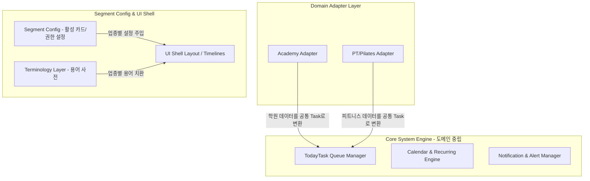

# Phase 8A: 오늘 원장 콘솔(Today Director Console) 전체 범위 및 MVP 기획 문서

본 문서는 DayDay의 차세대 핵심 개발 축인 **“오늘 원장 콘솔(Today Director Console)”**의 아키텍처 원칙, 전체 기능 범위, MVP 구현 대상, 데이터 모델 설계 및 단계별 구현 로드맵을 정의합니다.

---

## 1. 오늘 원장 콘솔의 목적

기존의 대시보드가 단순히 과거 데이터의 추이나 통계 지표를 시각화하는 '정적인 지표판'에 머물렀다면, **“오늘 원장 콘솔”은 원장이 출근해서 퇴근할 때까지 "오늘 처리해야 하는 업무를 실시간으로 제어하고 완결하는 동적인 업무 제어 센터"**를 지향합니다.

원장의 하루 일과 중 분산되어 있던 다음 업무들을 단일 뷰에서 통합 제어합니다:

> [!NOTE]
> 기존에 작성된 `docs/dayday_dashboard_light_mockup.html` 및 관련 목업 HTML은 실제 상용 구현 화면이 아니며, 오늘 원장 콘솔의 정보 구조와 방향성을 공유하기 위한 **기획 참고용 산출물**입니다. 실제 Phase 8C의 화면 구현은 DayDay 고유의 디자인 시스템 규격, 기존 사이드바 구조 및 Segment-First UI Shell 정의에 맞춰 새롭게 재구성합니다.
*   **출결 및 안전**: 미성년 원생의 미등원 체크, 차량 탑승/픽업 관리, 알림톡 발송 실패 감지.
*   **수납 및 결제**: 당일 결제 예정자, 미납 원생 대응, 가상 결제 상태 모니터링.
*   **교재 및 물류**: 오늘 지급되어야 할 교재 확인 및 미청구 금액 연동.
*   **리스크 관리**: 이탈 징후 원생(수강 태도 불량, 연속 결석 등) 경보.
*   **원장 메모 및 Google Calendar**: 개인 일정 및 학원 운영 일정 통합 관리.
*   **Delight Loop (경험 고도화)**: 칭찬 대상자 발굴, 학부모 상담 주기 알림, 리뷰 추천 후보 선정.
*   **마케팅 보조**: 상담 대기자 리드 및 재등록 유도 프로모션 관리.

---

## 2. Segment-First Architecture 적용 원칙

DayDay 프로젝트의 공통 아키텍처 규칙에 따라, 오늘 원장 콘솔은 향후 타 업종(PT/필라테스, 병원, 렌탈 스튜디오 등)으로 확장할 수 있도록 **Segment-First Architecture**를 엄격히 적용합니다.



*   **세그먼트 정의**: 본 콘솔은 음악학원 도메인 전용인 `academy_director_console` 세그먼트로 최초 구현됩니다.
*   **도메인 중립 Core Engine**:
    - 할 일 생성, 정렬, 우선순위 배정, 반복 루틴을 처리하는 `TodayTask` 상태 엔진은 학원 도메인에 종속되지 않는 범용 엔진으로 설계합니다.
*   **Domain Adapter**:
    - 학원의 고유 데이터(원생 정보, 출결 이력, 수납 예정일, 교재 지급)는 `Academy Adapter`를 거쳐 도메인 중립적인 `TodayTask` 모델로 정규화(Normalization)되어 코어 엔진에 주입됩니다.
*   **Segment Config & Terminology Layer**:
    - 업종별로 다르게 표시되어야 하는 명칭(예: 원생 $\rightarrow$ 회원, 강사 $\rightarrow$ 트레이너, 레슨 $\rightarrow$ 세션)은 소스코드에 하드코딩하지 않고, 용어 사전 레이어를 경유해 치환되도록 합니다.
    - 활성화할 카드 타입과 UI 템플릿 정보는 세그먼트 설정(`Segment Config`)을 통해 조절합니다.

---

## 3. 전체 포함 범위

원장 콘솔이 포괄하는 전체 비즈니스 범위는 다음과 같습니다.

*   **오늘 할 일 큐 (TodayTask Queue)**: 우선순위 및 타임라인에 따라 정렬된 실시간 액션 아이템 목록.
*   **출결/안전**: 키오스크 미태깅 학생 추적, 등하원 안심 문자 오발송/실패 내역 긴급 알림.
*   **수납/결제**: 당일 수납 예정일 도래 알림, 장기 미납자 독촉장 발송 액션 버튼.
*   **교재/물류**: 오늘 수업에 필요한 교재 지급 목록, 안전 재고 부족 경고.
*   **매니지먼트/리스크**: 이탈 위험군 원생 보고 및 원장 개입 유도.
*   **원장 수동 업무**: 당일 해야 할 개별 메모, 전화 약속, 알람 설정.
*   **Google Calendar 연동**: 외부 구글 캘린더에서 학원 일정 및 강사 근무 일정을 실시간으로 가져와 뷰에 오버레이.
*   **오늘 운영 타임라인**: 강사 출근 상태, 원생 등하원 타임라인, 수납 이벤트 발생 로그를 하나의 시간 흐름(Timeline)으로 시각화.
*   **직원/강사 운영 숫자**: 오늘 출근한 강사 수, 현재 수업 진행률, 강사별 일일 일지 작성 현황.
*   **월별 수납/손익**: 당월 목표 수납 금액 대비 달성률, 고정비 지출 및 정산 예정액 요약 브리핑.
*   **Delight Loop**: 이번 주에 칭찬 카드(진도 우수 등)를 받지 못한 학생 목록, 학부모 상담 주기 자동 알림.
*   **마케팅 보조**: 상담 대기자 알람, 신규 등록 리드 진척도 확인.
*   **실시간 알림**: 비정상 등원 시 브라우저 웹 푸시 알림 및 알림음(Sound Interface) 연동.

---

## 4. MVP 구현 범위

초기 릴리즈에서 핵심 가치를 검증하기 위한 최소 기능 제품(MVP)의 범위는 아래 영역으로 제한합니다.

1.  **오늘 할 일 큐 (TodayTask Queue)**:
    - 시스템 생성 경고 및 수동 등록 메모를 통합하여 리스트로 출력.
    - 완료(`done`), 연기(`snoozed`), 삭제(`dismissed`) 상태 제어.
2.  **출결/안전 알림 (MVP)**:
    - 수업 시작 후 일정 시간이 지나도 등원 태깅이 없는 원생을 감지하여 큐에 자동 생성 (`urgent`).
    - 이 때 미등원 판단 기준 지연 시간은 하드코딩하지 않고, **Segment Config의 `attendanceLateThresholdMinutes` 설정값**을 기준으로 동적 처리합니다 (MVP 기본값은 10분 또는 15분을 예시로 사용하되, 설정 변경이 가능하도록 설계).
3.  **원장 수동 메모/알람**:
    - 캘린더 형태 또는 콘솔 대시보드 내에서 특정 일자/시간에 노출될 수동 업무 메모 등록 및 TodayTask 연동.
4.  **오늘 운영 타임라인**:
    - 오늘 발생한 주요 로그(등원 체크, 강사 출근, 메모 완료 등)를 시간 역순으로 보여주는 스트림(Stream) 뷰.
5.  **Google Calendar 읽기 연동 기초**:
    - 구글 API를 이용하여 지정된 구글 캘린더의 일정을 화면 타임라인 상단 또는 할 일 목록에 오버레이하여 가져오는 읽기 전용 기능.
6.  **마감 전 체크 (Closing Checks)**:
    - 퇴근 전 반드시 확인해야 할 체크리스트(오늘 수업 미출결 원생 처리 여부, 당일 정산 마감 등) 제공.

---

## 5. 후순위 확장 범위

MVP 릴리즈 완료 후 점진적으로 추가할 고도화 기능 목록입니다.

*   **수납/손익 모듈 고도화**:
    - PG 연동 가상 계좌 결제 내역 실시간 대시보드 반영 및 미납금 자동 알림톡 예약 발송.
*   **강사 정산 및 일지 연동**:
    - 강사별 레슨 기여 세션 비율 자동 계산 및 당월 지급 예정 급여 가산출.
*   **교재비 자동 청구**:
    - 강사가 진도표에 교재 지급 마크를 하면 자동으로 원장 콘솔에 '수강료 합산 청구 대기' 태스크 생성.
*   **Delight Loop & 마케팅 API 연동**:
    - 네이버 예약 데이터 리드 자동 연동 및 원생별 정기 학부모 전화 상담 스케줄링 엔진 탑재.
*   **실시간 사운드 / Web Push 알림**:
    - 브라우저가 백그라운드에 있을 때도 기기 소리 및 푸시 알림으로 긴급 공지 전달.
*   **Google Calendar 양방향 Sync**:
    - DayDay 대시보드에서 등록한 일정이 구글 캘린더에 반영되고, 구글 캘린더에서의 변경 사항이 실시간으로 DayDay 내부 스토어로 상호 동기화되는 양방향 채널.

---

## 6. TodayTask 데이터 모델 초안

도메인 중립 Core Engine에서 다루게 될 할 일 객체의 세부 스키마 정의입니다.

| 필드명 | 타입 | 필수 여부 | 설명 |
| :--- | :--- | :--- | :--- |
| `id` | String (UUID) | 필수 | 태스크 고유 식별자 |
| `organizationId` | String | 필수 | 테넌트(사업장) 식별용 ID (`academyId`와 호환) |
| `segment` | String | 필수 | 활성 세그먼트 식별용 (예: `academy_director_console`) |
| `domain` | String | 필수 | 데이터 도메인 영역 (예: `academy`, `general`) |
| `source` | Enum | 필수 | 태스크 출처 (`system` \| `manual` \| `google_calendar` \| `recurring`) |
| `type` | Enum | 필수 | 태스크 종류 (`attendance` \| `billing` \| `pickup` \| `book` \| `risk` \| `praise` \| `marketing` \| `calendar` \| `closing` \| `memo`) |
| `priority` | Enum | 필수 | 우선순위 등급 (`urgent` \| `today` \| `closing` \| `info`) |
| `status` | Enum | 필수 | 진행 상태 (`open` \| `snoozed` \| `done` \| `dismissed`) |
| `dueAt` | ISO String | 필수 | 업무 마감 또는 발생 예정 시간 |
| `title` | String | 필수 | 태스크 제목 (화면 표시용) |
| `description` | String | 선택 | 세부 업무 내용 및 가이드 텍스트 |
| `relatedStudentIds` | Array[String] | 선택 | 연관된 원생(고객) ID 배열 |
| `relatedTeacherIds` | Array[String] | 선택 | 연관된 강사(직원) ID 배열 |
| `dedupeKey` | String | 선택 | 중복 태스크 생성 방지용 비즈니스 키 (예: `ATTENDANCE_LATE_S001_20260602`) |
| `externalId` | String | 선택 | 외부 연동용 ID (Google Calendar의 event.id 등) |
| `snoozedUntil` | ISO String | 선택 | 보류(snooze) 처리 시 재노출될 시각 |
| `completedAt` | ISO String | 선택 | 태스크 완료(done) 시각 |
| `dismissedAt` | ISO String | 선택 | 태스크 숨김/제외(dismissed) 처리 시각 |
| `visibilityRoles` | Array[String] | 필수 | 표시 권한 제어 (예: `['director']`, `['staff']`, `['finance']`) |
| `provider` | String | 선택 | 외부 연동 제공자 (예: `google_calendar`, `aligo`) |
| `actionType` | String | 선택 | 클릭 시 수행할 동작 유형 (예: `NAVIGATE`, `SEND_SMS`, `MODAL_OPEN`) |
| `actionPayload` | Object | 선택 | 동작 수행에 필요한 세부 파라미터 (예: `{ route: '/billing', studentId: 'S001' }`) |
| `createdAt` | ISO String | 필수 | 레코드 생성 일시 |
| `updatedAt` | ISO String | 필수 | 레코드 수정 일시 |

---

## 7. 할 일 큐 병합 규칙 (Task Merging Pipeline)

할 일 목록은 다양한 소스로부터 실시간으로 흘러들어와 하나의 통합 큐(Unified Today Queue)로 병합됩니다.

```
[출처 1: 시스템 자동 경고] ---> (Academy Adapter) ---┐
[출처 2: 원장 수동 메모]   --------------------------┼---> [ TodayTask Queue Engine ]
[출처 3: 구글 캘린더 일정] ---> (Provider Layer) ----┼---> [ (우선순위 및 dueAt 정렬) ]
[출처 4: 주기적 반복 루틴] --------------------------┘
```

1.  **동적 어댑터 변환**: `System Alerts` 및 `Google Calendar`와 같은 외부/간접 데이터는 각각 `Academy Adapter`와 `Provider Layer`를 거쳐 `TodayTask` 표준 규격으로 변환됩니다.
2.  **중복 제거 (De-duplication)**: 동일한 비즈니스 키(예: 동일 원생에 대한 당일 결석 경보)에 대해 중복 생성을 방지하는 유니크 키 제약 조건을 적용합니다.
3.  **상태 필터링**: `status`가 `done` 또는 `dismissed`가 아닌 활성화 상태(`open`, `snoozed` 중 지연 시간이 경과한 건)의 태스크만 목록에 노출합니다.
4.  **정렬 파이프라인**: 
    - **1순위**: `priority` (가장 높은 등급이 상단 배치)
    - **2순위**: `dueAt` (시간이 임박한 순서대로 정렬)

---

## 8. 우선순위 규칙 (Priority Matrix)

업무 혼선을 막기 위해 각 업무 유형별로 명확한 우선순위를 사전에 지정합니다.

*   `urgent` (긴급 처리):
    - 미성년자 안전 위협 요소 (차량 승하차 누락 등).
    - 수업 시작 후 일정 시간 내 미등원 학생 감지 (`attendance`).
    - 학부모 안심 문자 및 긴급 알림톡 발송 실패 안내 (`communication`).
*   `today` (오늘 중 완료 권장):
    - 당일 수납 예정 및 장기 미납 원생 안내 (`billing`).
    - 수업 교재 지급 및 수강료 합산 청구 대기 (`book`).
    - 학부모 예약 상담 스케줄 (`marketing`).
*   `closing` (마감 직전 체크):
    - 정산 마감 확인, 당일 수업 일지 작성 누락 직원 확인.
    - 반복 업무 루틴(소독 및 문단속 등).
*   `info` (참고 사항 및 여유 업무):
    - 칭찬/리뷰 작성 추천 후보 학생 안내 (`praise`).
    - 차주 생일자 정보 브리핑.

---

## 9. Google Calendar 읽기 연동 범위

구글 캘린더 API 연동은 안정적이고 가볍게 론칭하기 위해 MVP 단계에서는 **조회(Read) 중심**으로 구현을 제약합니다.

> [!IMPORTANT]
> MVP 개발 진행 시 실제 Google OAuth/API 직접 연동 및 구현은 Provider Layer 설계와 함께 **Phase 8D**에서 본격적으로 진행합니다.
> 이에 따라 선행되는 **Phase 8B 및 8C** 개발 단계에서는 Mock Provider 또는 Local Provider를 제작하여 오늘 할 일 큐(TodayTask Queue)에 일정이 병합되는 논리 구조를 우선 검증합니다.

*   **OAuth 및 범위 제한**: MVP 단계에서는 구글 API `https://www.googleapis.com/auth/calendar.readonly` 범위를 취득하여 학원 캘린더 데이터를 안전하게 획득합니다.
*   **캘린더 선택 기능**: 원장 계정에 등록된 캘린더 목록을 조회한 후, DayDay 화면에 동기화해 노출할 전용 캘린더(예: "학원 주요 행사", "강사 대직 일정")를 수동 선택할 수 있도록 구성합니다.
*   **오버레이 렌더링**: 구글 캘린더 일정을 자체 DB로 즉시 동기화해 저장하기보다, 원장 콘솔 로딩 시 동적으로 API를 읽어 타임라인 상단 및 오늘 일정 영역에 겹쳐서 표시(Overlay)합니다.
*   **태스크 전환**: 가져온 일정 중 제목에 `[DayDay-Task]` 등의 프리픽스가 붙어 있거나 수동 태깅을 누르면, 이를 일반 `TodayTask` 객체로 변환하여 처리 상태(`done`, `snoozed`)를 DayDay 내에서 추적할 수 있도록 지원합니다.

---

## 10. 달력 메모/알람 범위

원장이 DayDay 시스템 내부에서 직접 작성하는 고유 스케줄 및 알람 기능의 스펙입니다.

*   **날짜/시간 기반 메모**:
    - 원하는 날짜와 시간을 지정해 할 일(메모)을 간편하게 추가할 수 있습니다.
*   **태스크 전환 규칙**:
    - 작성된 메모의 일시가 "오늘"에 도달하면, 백그라운드 엔진이 해당 메모의 `source`를 `manual`, `type`을 `memo`로 설정하여 오늘 할 일 큐(TodayTask Queue)에 동적으로 로딩합니다.
*   **반복 루틴 설정**:
    - 매주 특정 요일, 혹은 매월 특정 일자에 지속 발생해야 하는 반복 메모(예: "매월 10일 세무 자료 전송") 설정을 지원합니다.
*   **상태 관리**:
    - 완료(`done`), 보류(`snoozed` - 1시간 뒤 또는 내일 다시 알림), 숨김(`dismissed`) 상태를 자유롭게 변경하고 히스토리를 보존합니다.

---

## 11. 구현 Phase 제안

본 기획 문서를 토대로 Phase 8을 다음과 같이 점진적으로 나누어 안전하게 수행할 것을 제안합니다.

```mermaid
gantt
    title Phase 8 오늘 원장 콘솔 개발 로드맵
    dateFormat  YYYY-MM-DD
    section 기획 및 모델링
    Phase 8A: 기획 문서 확정           :active, p8a, 2026-06-02, 1d
    Phase 8B: 데이터 모델 및 스토어 설계  : p8b, after p8a, 2d
    section MVP 구현
    Phase 8C: 오늘 원장 콘솔 화면 구현    : p8c, after p8b, 4d
    Phase 8D: Google Calendar 연동     : p8d, after p8c, 3d
    Phase 8E: 시스템 자동 경고 연계      : p8e, after p8d, 3d
    section 고도화
    Phase 8F: 후순위 확장 기능 적용      : p8f, after p8e, 5d
```

*   **Phase 8A: 기획 문서 확정 (현재 단계)**
    - 전체 설계 사양과 스키마 구조에 대해 정렬 및 확정합니다.
*   **Phase 8B: TodayTask 및 메모/알람 데이터 모델링**
    - `stateStore` 내에 `TodayTask`를 관리할 수 있는 컬렉션 추가 및 LocalStorageAdapter 기반 CRUD 로직을 설계합니다.
*   **Phase 8C: 오늘 원장 콘솔 MVP 화면 구현**
    - 사이드바 신규 메뉴 바인딩, 오늘 할 일 큐(TodayTask Queue) 리스트, 수동 알람 등록 컴포넌트, 운영 타임라인 스레드 레이아웃을 기존 UI 디자인 시스템의 아이덴티티를 살려 구현합니다.
*   **Phase 8D: Google Calendar 읽기 연동**
    - Google API 및 OAuth 연동을 실제 구체화하여 오늘 일정을 가져와 타임라인에 안전하게 오버레이 및 TodayTask 연계를 수행합니다.
*   **Phase 8E: 시스템 자동 경고 연계**
    - 수업 시작 시각과 출결 마킹 상태를 백그라운드에서 추적하여, Segment Config에 정의된 `attendanceLateThresholdMinutes` 기준 지연 시간 도달 시 `urgent` 등원 경고 태스크가 큐에 실시간 생성되도록 연계합니다.
*   **Phase 8F: 후순위 확장 기능 적용**
    - 수납 고도화, 양방향 싱크, 마케팅 및 리스폰스 칭찬 루프(Delight Loop)를 점진적으로 얹어 나갑니다.
