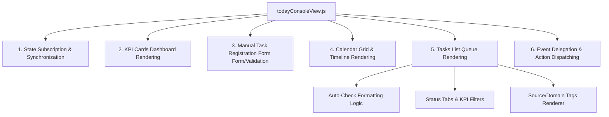

# Phase 15A: 오늘 원장 콘솔 모듈화 필요성 진단 및 설계 검토

본 문서는 오늘 원장 콘솔(`todayConsoleView.js`)의 현재 구현 복잡도를 진단하고, 향후 알림톡/문자/푸시(Phase 16A) 정책 결합을 앞두고 안정성과 확장성을 확보하기 위한 모듈화 설계를 검토하는 문서입니다.

---

## 1. 현재 `todayConsoleView.js` 역할 분해

현재 `todayConsoleView.js`는 약 1,830라인에 달하는 거대한 단일 뷰 스크립트 파일입니다. 이 파일은 다음과 같은 다중 도메인 및 UI 관심사가 복합적으로 얽혀 동작하고 있습니다.

### 1) 주요 포함 기능 상세
1. **상단 KPI 카드 렌더링 및 필터링:** 9개 KPI 카드 카운팅 및 클릭 시 해당 도메인 큐만 볼 수 있게 하는 로컬 필터링 상태(`selectedKpi`) 관리.
2. **운영메모/상담예약 입력 양식:** 시작/종료일 및 카테고리(메모/상담) 입력 폼 바인딩, 입력 시 종료일을 시작일 이후로 맞추는 유효성 및 자동 동기화 로직.
3. **달력 렌더링 및 연동:** 오늘 일정 월간 달력 그리드 연합 렌더링, 수동 일정 및 데모 일정의 칩 표시, 캘린더 칩 클릭 시 수정 폼 동기화 및 상세 팝업 레이어.
4. **운영 대기 업무 큐 렌더링:** `대기/완료/제외·보류/전체` 탭 필터링 및 각 도메인 태스크(출결, 근태, 수납, 교재 등)의 특화된 마크업 렌더링.
5. **태그/배지 및 액션 바인딩:** 왼쪽의 2줄 구조 태그(분류/도메인) 렌더링, 각 태스크별 완료(`done`), 보류(`snooze`), 제외(`dismiss`), 복원(`reopen`) 클릭 이벤트 위임(Event Delegation) 처리.

---

## 2. 안정성 리스크 진단

### 1) 단일 책임 원칙(SRP) 위반
* **진단:** UI 레이아웃 선언(HTML 문자열), 도메인별 포매팅 논리, 상태 동기화 구독, 이벤트 리스너 처리가 모두 한 곳에서 수행됩니다.
* **리스크:** 파일 전체의 응집력이 낮고, 코드 검색 및 유지보수가 어렵습니다.

### 2) 파급 효과(Ripple Effect) 및 취약성
* **진단:** 특정 도메인(예: 수강료 완납 배지 추가)의 마크업 스타일을 수정했을 때, 동일한 CSS 셀렉터가 달력 팝업이나 수동 태스크에 영향을 미쳐 사이드 이펙트가 발생하기 쉽습니다.
* **최근 사례 (Phase 13H/13I):** 완료된 카드의 상태 태그(`완료`)와 소스 태그(`확인필요`)가 둘 다 `.badge` 클래스를 사용함에 따라 E2E 테스트 코드(`locator('.badge')`)에서 Playwright Strict Mode 위반 에러가 발생하여 빌드가 깨지는 현상이 발생했습니다.

### 3) 상태/렌더/이벤트 결합도
* **진단:** `stateStore` 변경 감지 시 파일 전체를 새로고침하는 `render()`가 호출되어 전체 DOM을 교체합니다. 이로 인해 입력 중인 포커스가 소실되거나 팝업이 닫히는 현상을 유예하기 위해 각종 방어 코드들이 인라인에 산재되어 있습니다.

### 4) 리팩토링 시점 평가 (Risk & Benefit)
* **지금 당장 모듈화할 때의 위험 (Risk):**
  * Phase 16A(알림톡/메시징 정책)의 구체적인 명세가 정해지지 않은 상황에서 모듈화를 급하게 완료하면, 메시징 액션과 상태 컬럼이 대거 추가될 때 쪼개진 모듈 간의 결합부(Interface)를 다시 뜯어고쳐야 하는 **이중 공수(Double Work)**가 발생할 수 있습니다.
* **모듈화를 미룰 때의 위험 (Risk):**
  * 알림톡 전송 성공/실패/재시도 버튼 등 복잡한 비즈니스 로직과 UI 인터페이스가 1,830라인의 거대 파일에 직접 들어갈 경우, 파일이 **2,500라인 이상으로 비대화**되어 코드 변경 시 예기치 못한 스크립트 에러나 테스트 붕괴를 초래할 가능성이 극도로 높아집니다.

---

## 3. 테스트 안전망 평가

### 1) 현재 E2E 테스트의 보호 범위
* 현재 E2E 테스트 슈트는 결석, 지각, 미출근, 교재 지급, 주요일정 D-day 조건, 수동 필터링 등 오늘 콘솔에서 발생할 수 있는 거의 모든 시나리오를 보호하고 있습니다.
* 따라서 코드 모듈화 과정에서 기능적 오동작이 발생하면 **E2E 테스트가 즉각 100% 잡아낼 수 있는 안전망**이 마련되어 있습니다.

### 2) 모듈화 시 깨질 가능성이 높은 테스트
* **DOM 셀렉터 기반 테스트:** `tests/e2e/today-console-flow.spec.js`는 `#tasks-list-container`, `.glass-card`, `button[data-action="..."]` 등 마크업 구조에 크게 의존합니다. HTML 마크업 구조가 쪼개지면서 컨테이너 ID나 구조적 Depth가 바뀌면 E2E Selector가 쉽게 깨질 수 있습니다.
* **행동 기준 보장:** 모듈화 작업 전, 전체 테스트 스냅샷과 핵심 클릭 동작(`done`, `reopen`, `snooze`)의 Selector가 변경되지 않도록 클래스 설계와 ID 규칙을 유지해야 합니다.

---

## 4. 추천 모듈 분리 단위 (제안)

향후 리팩토링 진행 시, 다음과 같이 역할을 고립시키는 설계를 추천합니다.

1. **`todayConsoleKpi.js` (KPI 대시보드 컴포넌트)**
   * **책임:** 상단 9개 KPI 카드의 마크업 렌더링 및 선택 상태 변경 처리.
   * **입력:** `todayTasks` 전체 목록, `selectedKpi` 필터 상태.
   * **출력:** KPI 그리드 HTML 문자열.
   * **우선순위/난이도:** 높음 / 쉬움

2. **`todayConsoleCalendar.js` (오늘 일정 캘린더 컴포넌트)**
   * **책임:** 월간 그리드 렌더링, 오늘 일정 연동 스켈레톤, 일정 칩(+N 배지) 및 상세 레이어 포포버 제어.
   * **입력:** `calendarEvents` 및 `todayTasks` 일정.
   * **출력:** 월간 일정 캘린더 영역 HTML 및 팝업 DOM 제어.
   * **우선순위/난이도:** 중간 / 어려움

3. **`todayConsoleQueue.js` (업무 리스트 큐 컴포넌트)**
   * **책임:** 운영 대기 업무 리스트 카드 그룹 렌더링.
   * **입력:** `filteredTasks` (탭 및 KPI 필터가 적용된 태스크 목록).
   * **출력:** 업무 리스트 HTML 문자열.
   * **우선순위/난이도:** 최상 / 보통

4. **`todayConsoleTaskFormatters.js` (태스크 포맷팅 유틸리티)**
   * **책임:** 카테고리별 경고 텍스트 포맷, 배지 컬러 지정, 날짜 표기 가독화 등 순수 함수(Pure Functions).
   * **입력:** `task` 객체.
   * **출력:** 문자열, HSL 색상 코드.
   * **우선순위/난이도:** 최상 / 매우 쉬움 (가장 먼저 분리하여 코드 가독성 증대 가능)

5. **`todayConsoleEvents.js` (이벤트 헬퍼 및 액션 컨트롤러)**
   * **책임:** 완료, 보류, 제외, 복원, 교재 확인 클릭 등 비즈니스 로직 연동 및 API 호출 중계.
   * **입력:** Click/Submit Event 객체.
   * **출력:** `stateStore` 메소드 호출.
   * **우선순위/난이도:** 중간 / 보통

---

## 5. 모듈화 우선순위 제안 및 판단 근거

**[결론] C. 현재는 안정화 유지, 메시징 정책 수립 후 모듈화 (추천)**

### 판단 근거:
1. **메시징(알림톡/문자/푸시) 변경의 파급력:**
   * Phase 16A에서 메시징 발송 실패, 수동 발송, 알림톡 템플릿 검토 등의 운영 인터페이스가 오늘 콘솔의 각 카드 우측 영역에 직접 탑재될 예정입니다.
   * 이는 큐 카드(`todayConsoleQueue.js`)와 이벤트 컨트롤러(`todayConsoleEvents.js`)에 대대적인 기능 추가를 의미합니다.
2. **이중 공수(Double Work) 방지:**
   * 지금 당장 컴포넌트를 분리하더라도, 분리된 인터페이스 규격(Props / Event Payload)이 메시징 기능 개발 단계에서 또다시 변경될 것입니다.
   * 현재 E2E 테스트가 100% 통과하여 매우 안정적인 상태이므로, 불필요한 레이어 분리를 미리 진행하여 리스크를 키우기보다는 **안정성을 그대로 유지하고 Phase 16A 구현 시 함께 모듈화를 병행 수행**하는 것이 리소스를 절약하고 버그를 예방하는 검증된 접근법입니다.

---

## 6. 향후 메시징 정책(Phase 16A)과의 연결성 검토

Phase 16A 구현 시, 오늘 원장 콘솔은 메시징 처리의 **'통제 타워(Control Tower)'** 역할을 수행하게 됩니다.

* **메시지 발송 대기 큐:** 교재 지급 승인 시, "교재 지급 알림톡 발송 대기" 상태의 액션 버튼(예: [알림톡 발송])이 카드 우측에 추가 노출됩니다.
* **발송 상태 실시간 표시:** 발송 중(Sending), 발송 완료(Sent), 실패(Failed) 상태가 큐 카드 내에서 동적으로 업데이트되어 시각적으로 확인 가능해야 합니다.
* **실패 건 재시도 및 채널 전환:** 알림톡 발송 실패 시, 대체 채널(LMS/SMS)로 즉시 전환할 수 있는 재발송 버튼이 큐 카드 액션 영역에 밀접하게 연결됩니다.

---

## 7. 최종 권고안

1. **Phase 15A 시점:** 코드를 물리적으로 분리하지 않고 현재의 단일 파일을 유지합니다.
2. **Phase 16A 시작 시점:**
   * **1단계:** `todayConsoleTaskFormatters.js`로 포맷팅 및 배지 렌더링 로직(순수 함수)을 먼저 격리하여 `todayConsoleView.js` 파일의 볼륨을 줄입니다.
   * **2단계:** 메시징 액션과 비즈니스 로직을 처리하는 이벤트 위임 코드를 `todayConsoleEvents.js`로 통합 분리합니다.
   * **3단계:** 새로운 알림톡 발송 대기 UI 및 상태 표시 요구사항을 분리된 `todayConsoleQueue.js`에 얹는 방식으로 점진적 리팩토링을 완료합니다.
