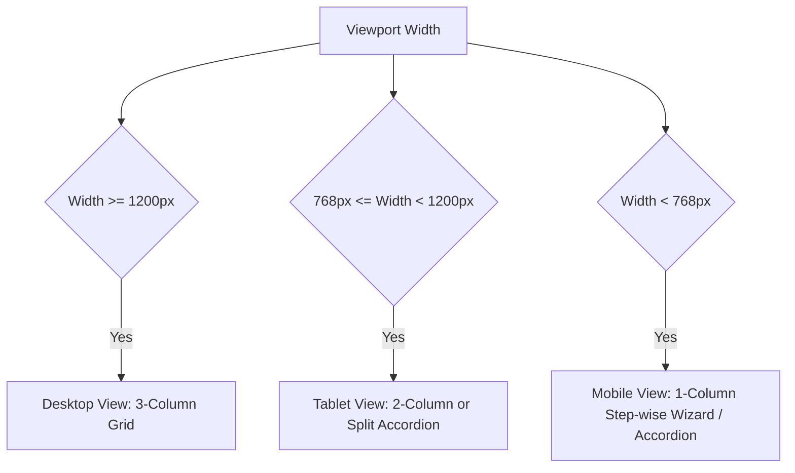

# Phase 16V: 원장 메시지 보내기 화면 좁은 화면/모바일형 UX Polish 설계 문서

본 문서는 원장 메시지 보내기 화면에 수신자 선택, 보호자 1/2 선택, 발송 전 확인 모달, 템플릿 초안 적용 및 오늘 콘솔 handoff 기능이 통합되면서 증가한 화면 복잡도를 해소하고, 데스크톱, 태블릿, 모바일 등 다양한 뷰포트 환경에서 안전하고 직관적으로 메시지를 작성 및 발송할 수 있도록 responsive UX polish 방향을 설계한 디자인 가이드 문서입니다.

---

## 1. Phase 16V 범위 정의

### 포함 범위
- **원장 메시지 보내기 화면의 좁은 화면/모바일형 UX 설계**: 화면 가로폭이 좁아지는 환경에서의 최적 레이아웃 설계.
- **수신자 선택 영역 (#studentListPanel, #recipientListPanel) responsive 구조**: 원생 목록 검색, 개별 보호자(본인/보호자1/보호자2) 선택 및 발송 대상 추가 흐름 최적화.
- **작성 패널 (#composePanel) responsive 구조**: 제목/본문 입력 필드, 메시지 종류, 템플릿 적용, 직접 번호 추가/엑셀 업로드의 공간 절약형 배치.
- **발송 전 확인 모달 (#focusConfirmOverlay) responsive 구조**: 모바일 뷰포트에서의 Full-Screen 모달 전환 및 요약 정보/수신자 미리보기 아코디언 영역 고도화.
- **오늘 콘솔 handoff 배너 (#messageSendDisclaimer) responsive 구조**: 모바일에서 본문 입력을 가리지 않도록 하는 배너 최적화 및 스크롤 포커스 보정.
- **접근성/가독성/오발송 방지 관점의 QA 기준**: 터치 타겟 크기, 대비(Contrast), 키보드 포커싱, 오발송 가드 설계.

### 제외 범위
- **실제 코드 구현**: HTML/JS 파일에 대한 실 가동용 JavaScript 코드 작성 배제.
- **CSS 수정**: `app.css` 또는 `messageSendView.js` 내의 실제 스타일시트 코드 수정 배제.
- **새 API 연동**: 서버와의 신규 HTTP API 인터페이스 연동 배제.
- **SMS/알림톡/Push 실제 연동**: 외부 발송 게이트웨이 연동 배제 (기존 Local Storage/Mock 상태 유지).
- **학부모 포털 화면 수정**: 학부모 화면의 반응형 보정은 본 Phase에서 다루지 않고 별도 분리.
- **오늘 콘솔 비즈니스 로직 변경**: 오늘 원장 콘솔 태스크의 생성/수명 주기 로직 배제.

---

## 2. 현재 메시지 보내기 화면 구조 요약

현재 원장 메시지 보내기 화면은 가로폭이 넓은 데스크톱 환경을 기준으로 설계되어 있으며, 주요 레이아웃 구성 요소는 다음과 같습니다:

1. **좌측 영역**:
   - **원생 리스트 (`#studentListPanel`)**: 원생 이름 검색창, 등원 여부/반 정보 필터, 원생 목록 테이블(체크박스 및 본인/보호자1/보호자2 수신 토글 제공).
   - **발송 인원 목록 (`#recipientListPanel`)**: 선택되어 발송 대기 상태인 원생 및 보호자들의 카드형 목록 리스트.
2. **중앙 영역**:
   - **보낼 메시지 작성 (`#composePanel`)**: 발송 방식 선택(SMS/LMS/알림톡/푸시), 발신 번호 표시, 메시지 유형 select 박스, 초안 템플릿 덮어쓰기 적용 버튼, 메시지 제목/본문 입력란(이름 매크로 `#{이름}` 삽입 안내), 직접 번호 추가 및 엑셀 일괄 추가 트리거, 중복 번호 자동 제거(Dedupe) 체크박스.
3. **우측 영역**:
   - **템플릿 보관함 (`#messageVaultPanel`)**: 9가지 기본 템플릿 초안(등원 알림, 하원 알림, 미수납 안내, 교재비 안내 등)을 선택해 즉시 본문에 덮어쓸 수 있도록 지원하는 영역.
4. **발송 바 및 확인 모달**:
   - **글로벌 발송 바 (`#globalSendBar`)**: 화면 하단에 고정되어 총 발송 대상 수와 최종 [발송하기] 버튼 제공.
   - **발송 전 확인 모달 (`#focusConfirmOverlay`)**: 치환된 개별 미리보기 아코디언, 요약 카드(수신처 수, 제외 수), 취소 및 [최종 발송] 버튼으로 구성된 최종 안전 가드.
5. **안내 및 연동 배너**:
   - **Handoff 배너 (`#messageSendDisclaimer`)**: 오늘 원장 콘솔에서 연동되어 들어올 경우 화면 최상단에 고정되어 handoff 상태임을 알리고 콘솔 복귀 버튼 제공.

---

## 3. 현재 UX 리스크 (좁은 화면에서의 예상 문제)

1. **좌우 병렬 컨텍스트 단절**:
   - 가로폭이 좁은 모바일 화면에서는 좌측 원생 리스트와 중앙 작성 패널이 세로로 흐르기 때문에(1열 배치), 수신자를 선택한 후 메시지를 작성하려면 화면을 길게 스크롤해야 하므로 사용자가 현재 어떤 수신자를 선택했는지 인지하기 어렵습니다.
2. **미세 터치 영역 및 오터치로 인한 오발송**:
   - 원생 리스트 내의 본인, 보호자1, 보호자2 체크박스 영역이 좁은 화면에서 조밀하게 렌더링되어 손가락 터치 시 오터치(Wrong-touch)가 자주 발생하며, 원치 않는 대상(예: 학생 본인)을 선택해 발송하는 중대한 오발송 사고가 유발될 수 있습니다.
3. **스크롤 부담 가중**:
   - 수신자로 선택된 원생 카드가 늘어남에 따라 발송 인원 영역이 세로로 길어져 메시지 작성 영역과 최종 발송 바가 화면 아래(Fold)로 완전히 밀려나게 됩니다.
4. **발송 전 확인 모달의 뷰포트 초과 및 이중 스크롤**:
   - 모바일 기기에서 30명 이상의 수신자가 포함된 경우 모달 내부의 개별 미리보기 아코디언 리스트가 모달 자체의 높이를 늘려 화면 밖으로 넘치며, 하단의 [최종 발송] 및 [취소] 버튼이 짤려 조작이 불가능해질 위험이 있습니다.
5. **Handoff 배너의 작성 영역 침범**:
   - 오늘 콘솔에서 메시지 보내기로 넘어왔을 때 노출되는 Handoff 안내 배너의 텍스트가 모바일 환경에서 여러 줄로 깨지며 화면의 세로 공간을 과도하게 차지하여 실제 메시지를 입력할 textarea가 화면 아래로 내려갑니다.
6. **기능 대비 지나치게 넓은 면적을 차지하는 부가 기능**:
   - 사용 빈도가 비교적 낮은 "수동 직접 입력" 및 "엑셀 추가" 버튼이 고정 영역을 상시 차지하여 좁은 화면에서 정작 중요한 입력/필터링 도구를 가립니다.

---

## 4. Responsive Breakpoint 제안

원활한 반응형 레이아웃 대응을 위해 아래의 3단계 Breakpoint를 제안합니다.



### 1) Desktop Breakpoint ($\ge 1200\text{px}$)
- **레이아웃**: 좌측(수신자/선택목록) - 중앙(작성패널) - 우측(템플릿)의 3열 그리드 또는 2열 그리드 구조 유지.
- **원칙**: 모든 원생 목록과 작성 폼, 템플릿 초안이 한 화면에 완전히 노출되어 마우스 조작 효율과 생산성을 극대화합니다.

### 2) Tablet Breakpoint ($768\text{px} \sim 1199\text{px}$)
- **레이아웃**: 수신자 선택 영역과 메시지 작성 패널을 좌우 2열로 축소 배치하되, 템플릿 보관함은 하단으로 흐르거나 필요 시에만 사이드 드로어(Drawer) 또는 탭 버튼을 통해 노출되도록 전환합니다.
- **원칙**: 화면 가로 폭이 부족할 경우 정보 영역을 2개 컬럼으로 묶어 배치하여 세로 스크롤 거리를 줄입니다.

### 3) Mobile / Narrow Breakpoint ($\le 767\text{px}$)
- **레이아웃**: 1열 그리드 구조로 전환.
- **원칙**: 수신자 선택 -> 본문 작성 -> 최종 검토의 3가지 핵심 작업을 분할하여 노출하는 **단계형 Wizard** 또는 **아코디언 폴더 구조**를 채택해 인지 과부하와 오터치를 방지합니다.

---

## 5. 레이아웃 후보 비교

모바일 및 좁은 화면을 지원하기 위한 4가지 레이아웃 구조 후보를 비교 분석합니다.

| 비교 항목 | 후보 A: 기존 2열 유지 + 내부 스크롤 | 후보 B: 상단 탭 전환 (Wizard형) | 후보 C: Accordion 단계형 (권장) | 후보 D: Bottom Sheet 미리보기 |
| :--- | :--- | :--- | :--- | :--- |
| **UX 개요** | 모바일까지 기존 2열 그리드를 억지로 축소하여 맞추고 내부 스크롤 제공 | 1단계: 수신자 선택<br>2단계: 내용 작성<br>3단계: 모달 검토 및 발송 | 수신자 선택 / 메시지 작성 / 발송 대기 영역을 각각 아코디언 탭으로 접고 폄 | 본문 작성을 하되, 수신자 목록과 검토 미리보기를 하단 Bottom Sheet로 띄움 |
| **오발송 위험** | **높음** (조작 실수 및 시인성 부족) | **보통** (이전 단계의 선택 수신자를 보려면 탭을 뒤로 가야 함) | **낮음** (아코디언을 펼쳐 실시간 대상 확인 용이) | **보통** (Bottom Sheet가 가릴 시 수신자 인지 불리) |
| **사용 속도** | **빠름** (한 화면에 다 있음) | **보통** (단계 전환 클릭 필요) | **빠름** (클릭 시 아코디언이 펼쳐져 즉시 작성 가능) | **보통** (시트 업/다운 조작 필요) |
| **구현 난이도** | **낮음** (기존 CSS 유지) | **보통** (State에 따른 탭 토글) | **낮음 ~ 보통** (CSS flex/hidden 및 아코디언 클래스 토글) | **높음** (모바일 스와이프 및 드래그 스크립트 필요) |
| **기존 영향**| **없음** (DOM 구조 변화 무) | **보통** (동시에 다수 패널이 보이지 않아 구조 변경 고려 필요) | **낮음** (요소가 DOM에 상시 존재하며 단지 접힌 상태이므로 영향 최소화) | **높음** (Bottom Sheet 도입에 따른 검증 방식 변경 등 부담 발생 가능) |
| **모바일 적합성**| **보통** (가독성 부족) | **우수** (화면이 매우 깔끔함) | **우수** (동선이 직관적이며 맥락 유지 가능) | **우수** (모바일 친화적 하단 제어) |

### 최종 권고안 (Final Recommendation)
**Desktop은 현재의 3열/2열 구조를 기존 구조와 동일하게 유지**하되, **Tablet/Mobile의 경우 후보 C(Accordion 단계형)를 적용할 것을 권장**합니다.
- **이유**: `studentListPanel`, `recipientListPanel`, `composePanel`이 항상 DOM에 유지되므로 기존 자동화 테스트의 가시성 및 상호작용 검증 구조를 거의 그대로 보존할 수 있으며, 미디어 쿼리와 CSS `max-height`/`transition`을 활용하여 모바일 화면에서 아코디언 폴더 형태로 안전하게 접고 펼칠 수 있습니다.

---

## 6. 수신자 선택 UX Polish 설계

1. **터치 대상 크기 최소 기준 준수**:
   - 모바일/좁은 화면에서 "본인", "보호자1", "보호자2" 개별 수신 체크박스와 라벨 영역은 패딩을 넓혀 최소 **$44\text{px} \times 44\text{px}$** 크기의 터치 반응 영역을 확보합니다.
2. **연락처 누락 및 수신 거부 상태 피드백**:
   - 보호자 정보가 없거나 수신 비동의(`disabled`) 상태인 행을 터치하려고 시도하는 경우, 조용히 반응을 차단하되 클릭 시 "연락처가 미등록되었거나 수신이 제한된 대상입니다"라는 문구를 툴팁 형태로 1.5초간 노출해 혼동을 예방합니다.
3. **동일 번호 다수 수신자 줄바꿈 최적화**:
   - 형제/자매 관계로 인해 하나의 연락처를 공유하는 중복 번호 표시 영역은 가로 폭이 좁아질 때 줄바꿈되어 짤리지 않도록 `text-overflow: ellipsis`를 사용하고, 터치 시 전체 번호와 관계를 팝오버로 보여주는 구조를 설계합니다.
4. **Handoff 진입 시 원생 Row 오프셋 자동 보정**:
   - 오늘 콘솔에서 [메시지 보내기]를 클릭해 진입했을 때, 타겟 원생 위치로 스크롤하는 `scrollIntoView()` 함수에 모바일 헤더 높이를 감안한 `scrollOffset` 보정을 추가하여 원생 정보가 헤더 배너 밑으로 기어들어가지 않도록 설계합니다.
5. **Sticky 발송 수량 요약 바 (Sticky Summary Bar)**:
   - 스크롤 위치와 무관하게 모바일 화면 하단에 `[ 총 N명 선택됨 - 발송 검토하기 ]`를 나타내는 Sticky Bottom Bar를 고정 배치하여, 수신자 스크롤 도중에도 언제든지 즉각적으로 다음 발송 단계로 이동할 수 있도록 유도합니다.
6. **"전체 삭제" 버튼 오터치 가드**:
   - 발송 대상 목록 전체를 초기화하는 "전체 삭제" 버튼은 오터치로 인한 데이터 유실을 방지하기 위해 붉은 아웃라인 스타일로 처리하고, 클릭 시 컨펌 모달 또는 2차 재클릭 확인(Double Tap to Clear)을 거치도록 설계합니다.

---

## 7. 작성 패널 UX Polish 설계

1. **메시지 유형 Select 및 초안 적용 버튼 세로 정렬 (Vertical Stack)**:
   - 가로폭이 부족한 모바일 뷰포트에서는 "SMS/LMS/알림톡/푸시" 종류 선택 Select 박스와 "초안 덮어쓰기 적용" 버튼을 한 줄에 나란히 배치하지 않고, 위아래로 쌓아 폭을 충분히 확보하는 형태로 전환합니다.
2. **`#{이름}` 매크로 안내의 공간 축약**:
   - 작성 폼 상단에 넓게 표시되던 `#{이름}` 치환 안내 배너는 모바일에서 아이콘 형태의 도움말 버튼(`[?]`)으로 대체하거나, 본문 textarea의 placeholder 내부에 `원생 이름 치환 매크로: #{이름}` 예시 문구로 포함시켜 시각적 가독성 면적을 보존합니다.
3. **Dynamic Height 입력란**:
   - 제목/본문 입력란의 모바일 기본 세로 크기는 최소 $120\text{px}$로 규정하며, 타이핑 분량이 늘어날 시 화면 전체를 밀어내지 않고 최대 $240\text{px}$ 한도로 유연하게 확장되며 내부에 스크롤바가 생기도록 설계합니다.
4. **수동 입력 및 엑셀 추가의 Collapsible (접힘) 처리**:
   - 화면을 크게 차지하는 수동 번호 입력 필드와 엑셀 템플릿 업로드 버튼은 기본적으로 아코디언 형태의 접힌 패널(`[+] 번호 직접 입력 / 엑셀 추가`)로 감싸두고, 필요 시 터치하여 펼치도록 설계해 입력 복잡도를 낮춥니다.
5. **Dedupe 중복 제거 옵션 위치 최적화**:
   - "중복 번호 제거 발송" 체크박스는 작성 폼의 최하단, 즉 최종 [발송 전 확인] 버튼 바로 위에 배치하여 원장이 발송 전 마지막으로 중복 여부를 눈으로 스캔할 수 있도록 만듭니다.
6. **Handoff 배너 축약**:
   - 오늘 콘솔 연동을 알리는 녹색 Handoff 배너는 모바일에서 텍스트 줄바꿈을 최소화하도록 핵심 문구("오늘 콘솔에서 연동되어 본문이 작성되었습니다.")로 1줄 요약하고 우측에 `[X]` 닫기 단추를 크게 탑재하여 작성 과정에서 스크롤을 방해하지 않도록 설계합니다.

---

## 8. 발송 전 확인 모달 UX Polish 설계

1. **모바일 Full-Screen Overlay 전환**:
   - 화면 가로폭이 $768\text{px}$ 이하일 때, 발송 전 확인 모달은 중앙 팝업 창이 아닌 **전체 화면(Full-Screen) 슬라이드업 레이어**로 전환하여 화면 전체를 100% 활용합니다.
2. **요약 정보 카드의 2x2 Grid / 세로 Compact 구성**:
   - 발송 방식, 최종 발송 인원수, 중복 번호 제거 차감 수, 제외 대상(연락처 누락/수신 거부) 수 등의 대시보드 요약 카드는 모바일에서 가로 4열 배치 대신 2x2 Grid 또는 세로 일렬의 얇은 칩(Chip) 형태로 전환하여 가시성을 유지합니다.
3. **미리보기 리스트 높이 제한 및 내부 스크롤 적용**:
   - 원생별 개별 치환 미리보기 아코디언 리스트 영역에 `max-height: 250px` 및 `overflow-y: auto` 속성을 부여하여, 대량 발송 시에도 모달의 최종 발송 버튼 영역이 화면 밖으로 넘치지 않게 가두어 둡니다.
4. **Sticky Footer 발송 및 취소 영역**:
   - 모달 하단 영역을 모바일 하단 뷰포트에 Sticky하게 고정(`position: sticky; bottom: 0;`)하여, 최종 [N건 최종 발송하기] 버튼과 [작성 화면으로 돌아가기(취소)] 버튼이 항시 노출되도록 제어합니다.
5. **오발송 방지를 위한 최종 승인 가드 제안 (선택 적용)**:
   - 모바일 환경에서 최종 발송 오터치를 줄이기 위한 후보 중 하나로 Swipe-to-Send 또는 길게 누르기 확인(Long Press) 방식을 검토할 수 있습니다. 단, 접근성과 구현 난이도를 고려해 후속 Phase에서 확정합니다.
6. **제외 대상 및 중복 병합 가시화**:
   - 중복된 수신 번호로 인해 합산 제외 처리된 리스트는 이름 우측에 회색 `[중복 제외]` 배지를 달고 연하게 렌더링하며, 미기입/거부로 인한 발송 제외 대상은 `[발송 불가]` 붉은 배지와 함께 사유를 병기하여 원장의 1차 필터링을 돕습니다.
7. **본문 미리보기 영역 최대 높이 및 축약**:
   - 최종 치환 적용된 본문 텍스트 영역의 글자수가 150자를 초과하는 경우, 본문 영역 높이를 `max-height: 120px`로 제한하고 스크롤 처리를 하여 모달 레이아웃을 컴팩트하게 보존합니다.

---

## 9. 접근성 및 오발송 방지 기준 (a11y)

1. **모바일 최소 터치 타겟 규격**:
   - 사용자가 한 손으로 휴대폰을 쥔 채 엄지손가락으로 쉽게 터치할 수 있도록 모든 인터랙티브 요소(버튼, 체크박스, 탭, 닫기 아이콘 등)는 최소 **$44\text{px} \times 44\text{px}$** 면적의 터치 타겟을 준수해야 합니다.
2. **명확한 Focus Outline**:
   - 물리적 키보드, 보조 입력 기기 또는 태블릿 키보드 악세서리를 사용하는 사용자가 탭 키로 화면을 조작할 수 있도록, 활성화된 포커스 상태에서는 크롬 브라우저 기본 포커스 이상의 눈에 띄는 아웃라인 스타일(`outline: 2px solid var(--primary); outline-offset: 2px;`)을 명시적으로 선언합니다.
3. **색상 의존성 탈피**:
   - 수신 가능 상태(그린), 발송 불가능 상태(레드), 보류 상태(옐로우) 등을 표시할 때 순수 배경색이나 텍스트 색상만으로 정보를 제공하지 않고, 각 상태에 상응하는 텍스트 설명 및 경고/체크 아이콘을 함께 렌더링해야 합니다.
4. **최종 동작 버튼들의 시각적 가중치 구분**:
   - [최종 발송] 버튼은 채도가 높은 메인 테마 색상(`var(--primary)` / `#2563eb`) 또는 안전 전송 색상(`var(--success)` / `#16a34a`)을 적용하고 솔리드(Solid) 배경을 입혀 최우선 순위로 부각시킵니다.
   - 반면 [취소 / 닫기] 버튼은 무채색 테두리(`var(--slate)` 아웃라인) 또는 어두운 회색 글씨 스타일을 취하여 발송 행동과의 인지 대비를 극명히 나눕니다.
5. **Active vs Selected vs Disabled 대비율 보장**:
   - 체크박스 및 토글 버튼의 각 상태는 4.5:1 이상의 대비를 이루어야 하며, 특히 선택 불가능한 상태(`disabled`)는 불투명도 조절(`opacity: 0.45`)과 함께 마우스 포인터를 `not-allowed`로 처리하여 혼동을 예방합니다.
6. **뷰포트/스크롤 점프 방지 (Jitter Prevention)**:
   - 모바일에서 아코디언이 열리거나 스크롤이 자동으로 타겟 위치로 튈 때 눈의 피로와 방향 상실을 막기 위해 CSS 상단에 `scroll-behavior: smooth;`를 정의하고 스크롤 포지션을 고정할 수 있는 앵커 계산법을 설계에 반영합니다.

---

## 10. 테스트 및 QA 시나리오 제안

추후 반응형 레이아웃 및 UX Polish 작업을 코드로 구현할 때, 이를 검증하기 위해 수행해야 할 테스트 스위트 및 QA 시나리오 제안 사항입니다.

### 1) 멀티 뷰포트 시나리오
- **1440px (Desktop)**: 화면 3열 그리드가 짤림 없이 병렬 노출되며, 좌측 스크롤과 중앙 입력이 독립적으로 거동하는지 검증.
- **1024px (Tablet Landscape)**: 우측 템플릿 영역이 아래로 숨겨지거나 사이드바 팝업으로 빠지며, 2열 수신자/작성이 정상 비례로 표현되는지 검증.
- **768px (Tablet Portrait)**: 화면이 1열 혹은 2단 접힘(아코디언) 구조로 안전하게 전환되며, 스크롤 위치가 유지되는지 확인.
- **390px (Mobile)**: 1열 Wizard/아코디언 구조로 완전 통합되고, 모든 조작 터치 범위가 $44\text{px}$ 이상으로 터치 가능하며, 확인 모달이 전체 화면(Full-Screen)으로 펼쳐져 [최종 발송] 버튼이 화면 고정 풋터로 동작하는지 검증.

### 2) 데이터 엣지 케이스 시나리오
- **대량 수신자 (30명 이상)**:
   - 30명 이상의 대규모 원생을 다중 선택하고 메시지 발송 전 확인 모달을 실행했을 때, 모달의 로딩 속도가 1초 이내인지 체크하고 아코디언 미리보기 영역이 스크롤되는지 검증.
- **보호자2 다수 선택**:
   - 원생들 중 보호자2 정보가 존재하는 경우만 정상적으로 발송 인원 추가 및 모달 내 개별 치환 미리보기에 "보호자2" 매핑 결과가 노출되는지 데이터 QA 수행.
- **중복 번호 (Dedupe) 매칭**:
   - 형제/자매 관계로 인해 동일 번호를 공유하는 원생 2명을 동시 수신자로 지정하고 dedupe 체크박스를 켰을 때, 최종 발송 카운트가 `1건`으로 합산 처리되는지 시나리오 검증.
- **제외 대상 필터링**:
   - 연락처가 없는 원생이 수신처에 들어갔을 때 목록에서 흐릿하게 표기되고 클릭 시 미입력 사유 툴팁이 잘 나오는지 확인.

### 3) 사용성 및 키보드 탐색 시나리오
- **Handoff 진입 시 스크롤 포커스**:
   - 오늘 콘솔에서 결석 원생 태스크를 통해 Handoff로 메시지 보내기로 진입했을 때, 모바일 뷰포트에서 상단 1줄 배너 아래로 타겟 원생의 Row가 `handoff-highlight` 스타일로 강조 표시되며 해당 위치로 자동 스크롤이 매끄럽게 흐르는지 검증.
- **Keyboard-only Operation**:
   - 터치나 마우스 조작 없이 `Tab` 키로 포커스를 옮겨 수신자 선택 -> 본문 작성 -> 발송 확인 -> 최종 발송 버튼까지의 전 과정을 `Space`와 `Enter`만으로 에러 없이 진행할 수 있는지 QA 검증.
- **Playwright Screenshot Regression**:
   - Playwright의 시각적 회귀(Visual Regression) 기능을 이용하여 뷰포트별 스크린샷 픽셀 테스트를 정의해 둡니다.
   ```javascript
   // 뷰포트 390px 모바일 환경의 확인 모달 스크린샷 픽셀 비교 예시
   test('confirm modal visual regression on mobile', async ({ page }) => {
     await page.setViewportSize({ width: 390, height: 844 });
     await page.goto('/dir-message-send');
     // ... 데이터 셋업 및 모달 열기 수행 ...
     await expect(page.locator('#focusConfirmOverlay')).toHaveScreenshot('mobile-confirm-modal.png', { maxDiffPixelRatio: 0.02 });
   });
   ```

---

## 11. 구현 단계 제안

본 Responsive UX Polish 설계 문서를 토대로 추후 개발을 실행할 때 제안되는 점진적 구현 로드맵 단계입니다.

1. **Phase 16V-1: CSS Breakpoint 및 Layout Skeleton 작업**
   - 그리드 미디어 쿼리 정의 및 모바일/태블릿용 1열/2열 레이아웃 구조의 CSS 및 스켈레톤 마크업 뼈대 확립.
2. **Phase 16V-2: 수신자 선택 Responsive Polish**
   - 터치 영역 확대 적용, 비활성 수신자 툴팁 탑재, 동일 번호 축약 렌더링 스크립트 보강.
3. **Phase 16V-3: 작성 패널 Responsive Polish**
   - 메시지 유형과 초안 버튼의 세로 병렬, 본문 textarea 자동 높이 계산, Handoff 안내 배너의 모바일 1줄 축약 및 수동/엑셀 추가 Collapsible화.
4. **Phase 16V-4: 발송 전 확인 모달 Mobile Full-screen**
   - 768px 이하 모달의 풀스크린 오버레이 전환, Sticky Footer 발송 바, 아코디언 미리보기 스크롤 한계선 CSS 설정.
5. **Phase 16V-5: Playwright Viewport Screenshot Regression 구축**
   - 뷰포트별 visual regression 자동화 테스트 코드 탑재 및 레이아웃 짤림 검증.
6. **Phase 16V-6: 수동 QA 및 세부 디테일 조율**
   - 모바일 크롬 개발자 도구 시뮬레이터 및 실제 태블릿 기기 실장 검증을 통한 세부 정렬 및 동작 피드백 반영.

---

## 12. 명시적 보류 항목

1. **실제 SMS/알림톡/Push 연동**:
   - 통신사 연동망 및 푸시 토큰 발송 서버 연동은 본 UX Polish 범위에서 완전히 배제하며, 기존에 구현된 Mock Local DB 로직을 그대로 보존합니다.
2. **독립된 메시지 전송 모달/새 창 분리**:
   - 메시지 보내기를 기존 단일 뷰가 아닌 독립 윈도우 팝업이나 별도 라우트 팝업으로 전체 구조를 교체하는 작업은 본 반응형 레이아웃 리팩토링 범주에서 제외하며, 차후 UX 독립 실험 Phase로 이관합니다.
3. **학부모 포털 모바일 Polish**:
   - 원장용 메시지 발송 화면의 모바일 고도화만 본 Phase에 해당하며, 학부모 포털 화면에 대한 추가 모바일 최적화 및 탭 레이아웃 보정은 별도의 Phase로 완전히 분리해 다룹니다.
4. **외부 API 비용 및 실패 정책 설계**:
   - 메시지 발송 1건당 발생하는 비용 계산기 연동, 발송 실패 시 캐리어 레벨의 재시도(Failover) 로직 등 비즈니스 백엔드 연동은 향후 Phase 16R 연동 구현의 백엔드 파트 개발 단계로 일임 보류합니다.
