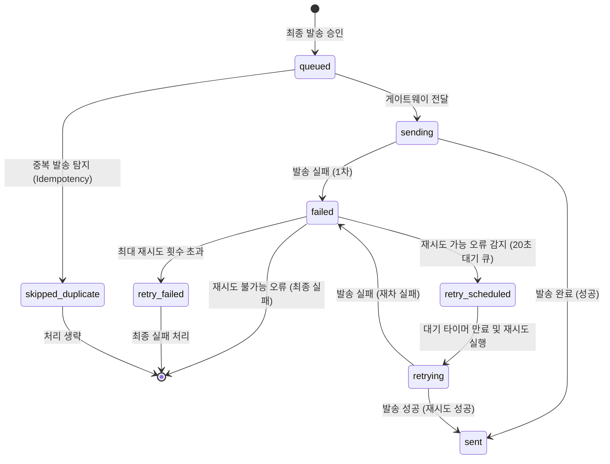

# Phase 16W-3: SMS Mock Provider 실패/재시도 상태 설계 문서

본 문서는 SMS/LMS Mock Provider 및 발송 결과 조회 기능 도입 이후, 발송 실패 처리, 자동/수동 재시도(Retry), 프로바이더 타임아웃, 부분 성공/실패, 그리고 중복 발송 차단 정책을 검토하기 위한 기술 설계 후보안 및 가이드라인입니다.

---

## 1. Phase 16W-3 범위 정의

### 포함 사항
* **SMS Mock Provider 실패 상태 분류**: 실패 코드 세분화 후보 정의
* **재시도 가능/불가능 실패 구분**: 일시적 오류와 영구적 오류 분류 후보 정의
* **상태 전이 후보 및 Lifecycle**: `retry_scheduled` 등을 포함한 상태 다이어그램 및 흐름 검토안
* **부분 성공/실패 처리**: 일괄 발송 시 수신자별 개별 상태 관리 모델 및 요약 요건 후보
* **중복 요청 차단 정책**: 네트워크 지연 및 이중 터치 방지를 위한 Idempotency/Deduplication 키 검토안
* **실제 SMS Provider 전환 시 고려사항**: Webhook, 비동기 상태 콜백, 과금 기준, 감사(Audit) 로그 마스킹 방안 검토
* **테스트/QA 검증 기준**: 후속 구현 단계에서 적용할 체크리스트 후보안
* **후속 단계 제안**: 16W-4 ~ 16W-8 로드맵 구성

### 제외 사항
* **실제 재시도 구현** (코드 작성 및 실행 제외)
* **실제 SMS/LMS 외부 API 연동** (외부 네트워크 호출, API Key 설정 및 벤더 라이브러리 도입 제외)
* **실제 Provider Timeout/Rate-limit 시뮬레이터 구현**
* **알림톡 Fallback 연동 및 Push 알림 연동**
* **현재 UI/UX 디자인 요소 및 CSS 수정**
* **현재 `outboundMessageDeliveries` 데이터 스키마 수정**

---

## 2. 현재 구현 상태 요약

* **발송 처리 모듈 (`outboundProvider.js`)**:
  * 최종 발송 버튼 클릭 시, 원장 UI 컨트롤러가 입력값을 취합하여 `stateStore.createOutboundRequest()`를 호출.
  * 전달받은 요청 객체는 `stateStore.sendSmsViaMockProvider()`를 통해 가상 SMS 프로바이더 인터페이스를 거침.
  * 이 과정에서 `stateStore.buildOutboundDeliveries()`를 통해 수신자별로 개별 `outboundMessageDeliveries` 레코드가 생성되어 로컬 DB 및 `localStorage`에 반영.
* **가상 실패 모의 기준 (Mock Failures)**:
  * 수신자 전화번호가 비어 있는 경우 (`EMPTY_PHONE`)
  * 전화번호의 유효 길이가 일치하지 않는 경우 (`INVALID_PHONE_LENGTH`)
  * 본문 텍스트가 존재하지 않는 경우 (`EMPTY_BODY`)
  * E2E 및 테스트 케이스 검증용 특정 실패 번호(예: `010-0000-0000`)인 경우 (`MOCK_TEST_FAIL`)
* **Mock 결과 조회 UI**:
  * 보관함/이력 패널의 우측 `"Mock 발송 결과"` 탭을 통해 최근 20건의 가상 전송 상세 로그를 내림차순(최신순)으로 열람 가능.
  * 개인정보 보호를 위해 원문 전화번호 및 `normalizedPhone`을 완전 마스킹(`recipientPhoneMasked` 만 노출) 및 `providerMessageId` 기본 숨김 처리.
  * 상단에 `"전체"`, `"성공"`, `"실패"` 간이 상태 필터 탭 제공.
* **영향성 관리**:
  * 기존 `outboundMessageLogs` 로그 보존 및 stub 저장 흐름 완전 유지.
  * 학부모 앱 내부 전용 수신함 데이터인 `parentMessages`는 일절 생성하지 않음.

---

## 3. 실패 코드 분류

### 기존 실패 코드
1. **`EMPTY_PHONE`**
   * **원인**: 수신 대상의 연락처 데이터가 유실되었거나 누락됨.
   * **재시도 검토 여부**: **불가 후보** (사용자 입력 수정 또는 데이터 복구 필요)
   * **원장 노출 메시지**: `실패 / 수신 번호 누락`
   * **로그 보존**: 필요
2. **`INVALID_PHONE_LENGTH`**
   * **원인**: 전화번호가 정해진 규격(10~11자리 숫자)보다 짧거나 비정상적임.
   * **재시도 검토 여부**: **불가 후보** (연락처를 직접 수정해야 발송 가능)
   * **원장 노출 메시지**: `실패 / 번호 형식 오류`
   * **로그 보존**: 필요
3. **`EMPTY_BODY`**
   * **원인**: 발송하고자 하는 메시지 텍스트 본문(body)이 비어 있음.
   * **재시도 검토 여부**: **불가 후보** (텍스트 입력 작성 필요)
   * **원장 노출 메시지**: `실패 / 발송 본문 없음`
   * **로그 보존**: 필요
4. **`MOCK_TEST_FAIL`**
   * **원인**: E2E 시나리오 및 모의 장애 검증을 위해 `010-0000-0000` 번호로 요청된 경우.
   * **재시도 검토 여부**: **불가 후보** (테스트 모의 장애용으로만 제한 사용 검토)
   * **원장 노출 메시지**: `실패 / 테스트 실패 번호`
   * **로그 보존**: 필요

### 향후 추가 설계 후보 실패 코드
5. **`PROVIDER_TIMEOUT`**
   * **원인**: 상용 SMS Gateway 또는 통신사 서버와의 요청-응답 제한시간 초과.
   * **재시도 검토 여부**: **가능 후보**
   * **원장 노출 메시지**: `실패 / 전송 시간 초과 (대기 후 재시도)`
   * **로그 보존**: 필요
6. **`PROVIDER_RATE_LIMIT`**
   * **원인**: 단위 시간당 발송 가능한 최대 건수를 초과하여 일시적으로 차단됨.
   * **재시도 검토 여부**: **가능 후보** (API 호출 쿼터 분산 처리 검토)
   * **원장 노출 메시지**: `실패 / 요청 한도 초과 (대기 후 자동 재시도)`
   * **로그 보존**: 필요
7. **`PROVIDER_AUTH_ERROR`**
   * **원인**: API Key 유효기간 만료, 잘못된 크레덴셜 설정 또는 차단된 계정.
   * **재시도 검토 여부**: **불가 후보** (관리자 설정 개입 필요)
   * **원장 노출 메시지**: `실패 / 프로바이더 인증 오류 (관리자 문의)`
   * **로그 보존**: 필요 (고객 지원 및 디버깅용)
8. **`PROVIDER_NETWORK_ERROR`**
   * **원인**: 인터넷 회선 장애, 게이트웨이 IP 차단, 혹은 DNS 해석 실패.
   * **재시도 검토 여부**: **가능 후보** (인프라 복구 시 전송 성공 가능성)
   * **원장 노출 메시지**: `실패 / 통신망 장애 (자동 재시도 예정)`
   * **로그 보존**: 필요
9. **`PROVIDER_REJECTED`**
   * **원인**: 발신 금지 문구 포함(스팸 차단), 사전 미등록 발신 번호 오용 등 게이트웨이 단계의 명시적 거절.
   * **재시도 검토 여부**: **불가 후보** (발신 번호 등록 정보 및 차단 키워드 점검 필요)
   * **원장 노출 메시지**: `실패 / 발송 거절 (발신번호 또는 차단어 확인)`
   * **로그 보존**: 필요
10. **`RECIPIENT_BLOCKED`**
    * **원인**: 수신자가 광고 수신 거부를 설정했거나 영구 차단 목록(Blacklist)에 등록됨.
    * **재시도 검토 여부**: **불가 후보**
    * **원장 노출 메시지**: `실패 / 수신거부 대상자`
    * **로그 보존**: 필요
11. **`DUPLICATE_REQUEST`**
    * **원인**: 동일한 고유 ID(idempotencyKey)를 지닌 요청이 중복되어 게이트웨이가 차단함.
    * **재시도 검토 여부**: **불가 후보** (이미 이전 전송이 완료 또는 대기 중임)
    * **원장 노출 메시지**: `실패 / 중복 발송 방지됨`
    * **로그 보존**: 필요 (중복 발송 증적용)
12. **`UNKNOWN_ERROR`**
    * **원인**: 분류되지 않은 미정의 하부 시스템 또는 시스템 단절 오류.
    * **재시도 검토 여부**: **상황에 따른 검토 후보** (일단 재시도 큐에 적재 후 재평가)
    * **원장 노출 메시지**: `실패 / 기타 오류 발생 (재발송 요망)`
    * **로그 보존**: 필수

---

## 4. 재시도 가능/불가능 정책

* **자동 재시도 대상 오류 후보**:
  * 일시적인 네트워크 장애(`PROVIDER_NETWORK_ERROR`), 전송 지연 및 게이트웨이 부하 타임아웃(`PROVIDER_TIMEOUT`), 호출 분당 제한(`PROVIDER_RATE_LIMIT`) 등은 일시적 인프라 이상이므로 시스템 내부에서 비동기적으로 일정 횟수 자동 재시도를 처리하는 방향을 검토합니다.
* **재시도 차단 대상 오류 후보**:
  * 수신 데이터 원천 결함(`EMPTY_PHONE`, `INVALID_PHONE_LENGTH`), 발송 내용 미비(`EMPTY_BODY`), 권한 누락(`PROVIDER_AUTH_ERROR`), 차단 대상자(`RECIPIENT_BLOCKED`), 정책적 중복 필터링(`DUPLICATE_REQUEST`)은 여러 번 재발송을 시도해도 성공할 수 없고, 통신 비용 및 리소스 낭비만 초래하므로 즉시 영구 실패로 전환하고 재시도를 방지하는 방향을 검토합니다.
* **`MOCK_TEST_FAIL` 취급**:
  * 본 실패 코드는 테스트 안정성 확보 및 Mock 환경 구동용 코드이므로 **재시도 불가 후보**로 검토 권고하며, 실제 운영 코드로 확장하지 않도록 유의합니다.

---

## 5. 상태 전이 후보

향후 상세 비동기 발송 파이프라인으로 전환할 경우, 다음과 같은 점진적인 전송 Lifecycle 상태 전이 모델을 후보로 제안합니다.

### 상태 설명
* **`queued`**: 발송 요청이 접수되어 큐에 적재된 초기 상태 후보.
* **`sending`**: Mock Provider / 게이트웨이 API에 전송 요청을 송신하고 응답을 대기 중인 상태 후보.
* **`sent`**: 최종 발송 성공 처리를 확인한 상태 후보.
* **`failed`**: 발송 실패가 최초 감지된 상태 후보.
* **`retry_scheduled`**: 재시도 가능 에러 코드로 판단되어 백오프 대기 큐에 등록된 상태 후보.
* **`retrying`**: 대기 후 게이트웨이에 재전송을 전달하고 있는 상태 후보.
* **`retry_failed`**: 지정된 최대 임계치(예: 3회)까지 재시도했음에도 모두 실패한 영구 실패 상태 후보.
* **`skipped_duplicate`**: 멱등성 검사 결과 중복이 식별되어 전송을 안전하게 우회한 상태 후보.

---

## 6. 재시도 제한 정책

* **최대 재시도 임계값**:
  * 자동 재시도는 최대 2~3회 범위의 제한과 지수형 지연(Exponential Backoff) 후보를 검토할 수 있습니다. 실제 재시도 횟수, 간격, 수동/자동 여부는 운영 비용과 provider 제한 정책을 확인한 뒤 후속 Phase에서 확정합니다.
* **지수형 지연(Exponential Backoff)**:
  * 1차 실패 시 30초 대기, 2차 실패 시 2분 대기 등으로 재시도 간의 간격을 점진적으로 확장하여 게이트웨이 일시 부하 해소를 대기하는 방안을 후보로 검토합니다.
* **재시도 그룹 관리**:
  * `requestId + recipientPhoneHash + channel` 조합의 고유 식별키를 기반으로 재시도 히스토리 체인(Retry Chain)을 구조화하여 개별 발송 단위별 시도 횟수를 추적 및 제어하는 방안을 고려합니다.
* **자동 vs 수동 재시도 구분**:
  * 시스템에 의한 자동 백오프 재시도는 인프라 에러에 한해 실행하며, 원생 번호 수정 후 전송 등 원장이 수동 개입하는 재시도는 후속 Phase에서 "수동 전송 버튼 UI" 기획 및 설계 단계에서 구체적으로 검토합니다.

---

## 7. 중복 요청 차단 정책

* **중복 제거 키 (Idempotency Key) 후보**:
  1. `requestId + recipientPhoneHash + channel` (배치 발송 고유 검증키 후보)
  2. `taskId + bodyHash + recipientPhoneHash + channel` (오늘 콘솔 연동 등 비동기 업무 트랜잭션 전용 중복 검사 후보)
  3. `delivery.idempotencyKey` (수신자 개별 수준 고유 UUID 필드 후보)
* **발송 차단 정책 후보**:
  * 동일 브라우저 탭에서의 더블 클릭 또는 다중 세션 요청 방지를 방어하기 위해, 동일 Idempotency Key를 가진 전송 요청 발생 시 후속 구현 단계에서 중복 발송을 방지하고 `skipped_duplicate` 상태 전이 후보로 우회하는 방안을 검토합니다.
  * 이미 `sent` 상태를 획득한 수신자에 대해서는 어떠한 재시도 배치나 중복 요청이 도달해도 무시 또는 우회 처리하여 이중 과금을 배제하는 방향을 고려합니다.
  * 중복 차단 식별 시 신규 delivery 레코드를 삽입하는 대신 기존 delivery 데이터의 이력 필드(예: `duplicateCount`)를 1 증가시키는 방식 등으로 중복 로그를 간결하게 유지하는 방안을 설계 후보로 검토합니다.

---

## 8. 부분 성공/실패 처리

* **배치 요청과 개별 전송 상태 분리**:
  * 한 번에 10명의 원생에게 단체 문자를 발송할 때, 1개의 `outboundMessageLog` (전체 발송 요청 그룹)에 매핑되는 10개의 `outboundMessageDeliveries` (개별 전송 결과)를 생성하고 관리하는 모델을 후보로 검토합니다.
  * 전체 요청의 통합 상태는 하위 Deliveries의 요약으로 결정하는 방향을 후보로 검토합니다 (예: "전체 성공", "일부 실패", "전체 실패").
* **UI 요약 표시 후보**:
  * 원장 화면 상단의 완료 안내 또는 히스토리 요약 영역에는 개별 전화번호 리스트를 나열하는 대신 `[성공: N건 / 실패: M건 / 제외: K건]` 형태로 그룹핑하여 종합 현황을 직관적으로 보여주는 요약 표시 후보 방안을 검토합니다.
* **부분 실패 재전송**:
  * 전체 10명 중 8명이 성공하고 2명이 통신망 일시 오류로 실패한 경우, 자동 또는 수동 재시도는 오직 실패한 2명의 delivery 레코드만 대상으로 한정하여 작동하며, 이미 성공한 8명에게 동일 문자가 재발송되는 일이 없도록 필터링하는 방안을 고려합니다.

---

## 9. 실제 Provider 전환 시 고려사항

* **비동기 전달 확인(Delivery Reports)**:
  * 대다수 SMS 게이트웨이(예: 알리고, 솔라피, 인포뱅크 등)는 API 호출 즉시 실제 폰 수신 결과를 주지 않고 `수락(Accepted)` 또는 `전송중` 상태만 1차 반환하는 것이 일반적입니다.
  * 실제 성공/실패 여부는 약 2초 ~ 1분 뒤에 공급업체가 전달하는 Webhook 콜백이나 API Polling을 통해 비동기 업데이트되므로, UI가 `sending` 상태에서 Webhook에 의해 `sent`/`failed`로 전이되는 비동기 상태 동기화 후보 아키텍처를 검토합니다.
* **과금 산정 시점**:
  * 단순 API 호출 성공 시점이 아닌, 통신사 도달 완료 보고(`sent` 수신 시점) 또는 통신사 거절 시점에 맞춰 실제 발송 머니 충전 잔액을 실시간 증감 및 정산하는 구조를 후보로 검토합니다.
* **감사(Audit) 로그 및 규제 준수**:
  * 본문 내용 내 스팸 문구 필터링, 야간 발송 제한(21시~08시 광고성 문자 전송 제한 규제) 필터를 적용하는 방안을 검토합니다.
  * 보존 데이터베이스 및 시스템 감사 로그에서 개인정보는 엄격히 암호화 저장되어야 하며, UI에는 마스킹된 `recipientPhoneMasked`만 지속 전달되어 개발자 또는 시스템 관리자가 원문 개인정보를 무단 복제/탈취하지 못하도록 통제하는 보안 가이드를 검토합니다.

---

## 10. 테스트/QA 기준

향후 본 설계를 바탕으로 기능 구현을 진행할 때, 검증할 수 있는 핵심 시나리오 후보는 다음과 같습니다.

1. **에러 코드별 재시도 분기 테스트 후보**:
   * `INVALID_PHONE_LENGTH` 발생 시 UI에서 재시도 트리거가 불가하며 영구 실패 상태가 유지되는지 검증.
   * `PROVIDER_TIMEOUT` 시뮬레이션 시 지정된 백오프 타이머(예: 30초) 후 자동 재시도 큐가 실행되는지 검증.
2. **이중 전송 차단 검증 후보**:
   * 동일한 수신 번호와 본문 내용으로 최종 발송 버튼을 빠르게 2회 연속 클릭 시, 실제 발송 건은 1건만 나가고 2번째 요청은 중복 제거 처리(`skipped_duplicate`)되는지 검증.
3. **부분 실패 단독 재시도 검증 후보**:
   * 3명 중 1명에게만 임의 실패 번호(`010-0000-0000`)를 섞어 발송 후, 실패한 1건에 대해 재시도를 트리거할 때 성공한 2명에게는 중복 발송 메시지가 도달하지 않는지 검증.
4. **개인정보 은닉 지속 검증 후보**:
   * 재시도가 실행되는 백그라운드 처리 흐름, 오류 로깅, UI 업데이트 과정 전체에서 원문 전화번호 및 `normalizedPhone`이 콘솔 로그나 브라우저 개발자 도구의 응답(Network JSON) 상에서 노출되지 않는지 재차 검증.

---

## 11. 후속 구현 단계 제안

* **Phase 16W-4: retry state 필드 및 idempotencyKey 설계/구현**
  * `outboundMessageDeliveries` 컬렉션에 `idempotencyKey`, `retryCount`, `status` 확장 상태값(`queued`/`sending` 등) 필드 반영 및 스키마 검증 추가.
* **Phase 16W-5: Mock provider timeout/rate-limit 실패 시뮬레이션**
  * 랜덤 및 특정 트리거 조건에 맞춰 `PROVIDER_TIMEOUT` 및 `PROVIDER_RATE_LIMIT` 오류를 방출하는 모의 어댑터 확장.
* **Phase 16W-6: 실패 delivery 수동 재시도 UI**
  * 원장이 직접 "Mock 발송 결과" 탭에서 실패 건 옆의 `[재시도]` 버튼을 눌러 수동 재전송을 요청할 수 있는 간이 트리거 UI와 액션 리스너 추가.
* **Phase 16W-7: provider callback/webhook mock**
  * 가상 비동기 결과 처리를 위해 2초 뒤 상태를 변경하는 `setTimeout` 기반 가상 Webhook 수신 모듈 구현.
* **Phase 16W-8: 실제 SMS provider adapter 후보 비교 및 선정**
  * 상용 API 공급자별 스펙 분석 및 실제 Adapter 패턴 도입 준비.
