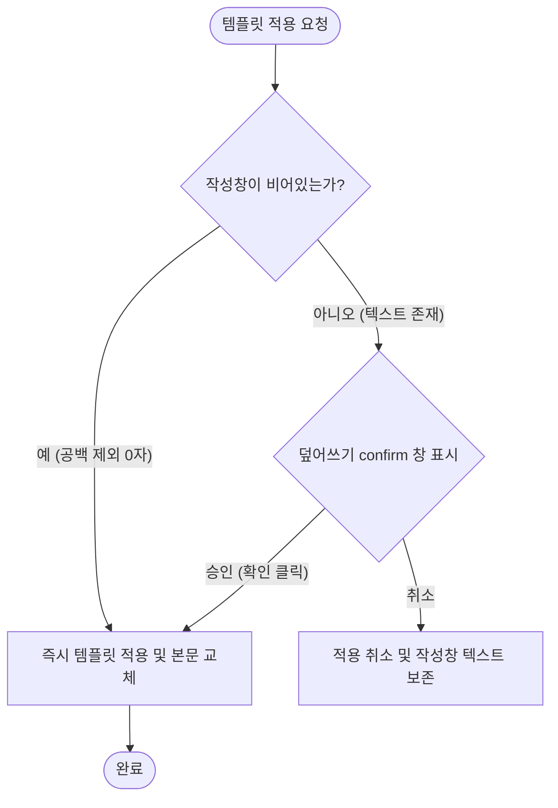

# Phase 16W-8: 메시지 템플릿 정책 정리 및 설계 (보정 반영본)

본 문서는 원장 메시지 보내기 화면에서 사용되는 **시스템 상황별 기본 템플릿**과 **원장이 저장하는 커스텀 템플릿**의 역할 정의, 로딩 우선순위, 본문 덮어쓰기 정책 및 데이터 모델 후보군을 정리한 설계 가이드라인입니다.

---

## 1. 현재 구현 상태 (Current Implementation Status)

현재 `messageSendView.js` 및 `state/communication.js`에 구축되어 있는 메시지 템플릿 관련 기능은 다음과 같습니다.

* **메시지 유형 드롭다운 (`templateTypeSelect`)**: 중앙 메시지 작성 패널 상단에 `TEMPLATES_MAP`에 정의된 상황별 기본 템플릿을 선택할 수 있는 콤보박스가 배치되어 있습니다.
* **초안 적용 버튼 (`#btnApplyTemplateDraft`)**: 드롭다운에서 선택한 기본 템플릿을 실제 메시지 제목 및 본문 폼에 복사/대입해 줍니다.
* **기본 본문 덮어쓰기 확인 (`confirm`)**: 메시지 본문에 임의의 텍스트가 이미 작성되어 있는 경우, `confirm("이미 작성된 본문 내용이 있습니다. 선택한 템플릿 초안으로 덮어쓰시겠습니까?")` 경고창을 띄워 사용자 실수로 인한 입력 정보 소실을 방어합니다.
* **치환 변수 매크로 (`replaceMacros`)**:
  * **공식 지원 및 UI 노출 변수**: `#{이름}` ➡️ 수신자 개별 원생 실명 (`recipient.name`)으로 자동 치환
  * **코드 내부 테스트 지원 변수**: `#{원생명}`, `#{학원명}`, `#{발신번호}` 등이 자바스크립트 치환 함수에는 구현되어 있으나, 사용자에게 복잡성을 피하게 하고자 UI 폼에는 공식 노출을 유보하고 내부 로직으로만 매핑되어 있습니다.
* **오늘 원장 콘솔 Handoff 초안 자동 주입**:
  * 오늘 원장 콘솔(미결석 알림, 미납 안내 등)의 업무 카드에서 "메시지 발송" 버튼을 눌러 본 화면으로 진입하는 경우, URL/State 페이로드(`suggestedTemplateType`)를 확인하여 알맞은 기본 템플릿을 작성 영역에 자동으로 미리 채워 줍니다. (단, 기존 작성 글이 없는 완전 공란인 경우에만 자동으로 채워집니다)
* **우측 메시지 보관함 (Message Vault) 구성**:
  * 화면 우측 3단 레이아웃의 마지막 열인 `#messageVaultPanel` 내부에 **추천(MOCK_RECOMMENDED)** / **저장(stateStore.getMessageTemplates())** / **최근 발송** / **수신 결과**의 4개 탭을 지원합니다.

---

## 2. 템플릿 종류 정의 (Template Types)

### A. 시스템 기본 상황별 템플릿 (System Default Templates)
시스템 내부 코드(`TEMPLATES_MAP`)에 사전 선언되어 제공되는 템플릿으로, 원장이 임의로 삭제할 수 없으며 표준화된 업무 시나리오에 즉각 대응합니다.
1. **결석 확인 (`absent`)**: 미출석 원생 대상 긴급 확인 요청 메시지
2. **상담 안내 (`consulting`)**: 정기/수시 학부모 상담 일정 조율 안내
3. **수강료 수납 안내 (`tuition_info`)**: 정기 수강료 납부 요청 및 가상계좌 정보 안내
4. **수강료 미수납 안내 (`tuition_unpaid`)**: 납부 기한 초과 또는 미납 건 독촉/재확인 메시지
5. **수강료 수납 완료 (`tuition_success`)**: 수강료 입금 확인 및 감사 인사 메시지
6. **교재비 수납 안내 (`book_info`)**: 지정 교재 구입 비용 청구 메시지
7. **교재비 미수납 안내 (`book_unpaid`)**: 교재비 미납 독촉/재확인 메시지
8. **교재비 수납 완료 (`book_success`)**: 교재비 입금 확인 안내 메시지
9. **일반 안내 (`general`)**: 특정 주제가 없는 자유 서식 초안

### B. 원장 저장 템플릿 (Director-Saved Custom Templates)
원장이 필요에 따라 직접 제목과 본문을 작성하여 반복 사용하기 위해 저장하는 템플릿입니다.
* **용도**: 학원 특별 이벤트(예: 정기 연주회 초대), 계절별 수강 모집 광고, 방학 안내, 기타 학원 자체 공지 문구 저장
* **저장 범위 우선 제안**: **학원 단위(academyId) 공유 후보를 우선 후보로 제안**하여 동일 학원에 소속된 여러 명의 강사와 직원이 템플릿을 함께 사용할 수 있도록 검토합니다.

#### 개인별 저장 범위(`directorId`)와 학원 단위 공유 범위(`academyId`)의 장단점 비교

| 구분 | 개인별 저장 범위 (`directorId`) | 학원 단위 공유 범위 (`academyId`) [우선 제안] |
| :--- | :--- | :--- |
| **개념** | 작성자 본인만 조회가 가능하고 독립적으로 관리 | 동일 학원에 속한 모든 직원 및 강사가 함께 조회가 가능 |
| **장점** | * 개인별 메시지 발송 톤앤매너 분리 유지 가능<br>* 타인의 수정이나 삭제로부터 안전함 | * 대표 전송 문구를 한 번만 지정해 두면 전체 협업 가능<br>* 통일된 학원 안내 포맷 유지에 효율적 |
| **단점** | * 동일 문구를 사용하기 위해 수동으로 복사해서 인계해야 함<br>* 협업 효율이 감소함 | * 무분별한 수정/삭제가 일어날 경우 템플릿 꼬임 우려<br>* 사용되지 않는 미사용 템플릿으로 목록이 비대해질 수 있음 |

---

## 3. 기본 템플릿과 저장 템플릿의 차이

| 구분 | 시스템 기본 템플릿 | 원장 저장 템플릿 |
| :--- | :--- | :--- |
| **제공 주체** | 시스템 빌트인 (하드코딩) | 원장/사용자 직접 생성 |
| **수정 및 삭제** | 불가 (시스템 업데이트로만 일괄 조정 가능) | 자유롭게 추가, 수정, 삭제 가능 |
| **추천 연동** | 오늘 업무 콘솔 Handoff와 1:1 매칭 지원 | Handoff 매칭 미지원 (사용자 수동 선택만 가능) |
| **UI 노출 영역** | 상단 드롭다운 (`select`) 및 퀵 초안 적용 | 우측 메시지 보관함(Vault) "저장" 탭 |

### UI 배치 전략 비교 분석

* **대안 1 (통합 드롭다운 방식)**:
  * 드롭다운 select 박스 안에 기본 템플릿 리스트와 저장 템플릿 리스트를 카테고리 구분선(optgroup)으로 묶어 함께 노출하는 방식.
  * *장점*: 상단 한 곳에서 모든 초안을 찾아 적용할 수 있어 직관적임.
  * *단점*: 저장 템플릿의 수가 많아지면 드롭다운 스크롤이 길어지고, 템플릿 관리(수정/삭제/추가)를 위한 모달 호출 동선이 꼬이기 쉬움.
* **대안 2 (분리 배치 방식 - 권장)**:
  * 기본 템플릿은 작성 폼 상단의 드롭다운으로 채택하고, 원장 저장 템플릿은 우측 3단 레이아웃의 **메시지 보관함(Message Vault) 내 "저장" 탭**에서 리스트 카드 형태로 분리하여 노출하는 방식.
  * *장점*: 저장 템플릿의 상세 본문을 우측 카드를 통해 미리 읽기 편하며, 각 카드 우측 상단에 `[적용]`, `[수정]`, `[삭제]` 기능 버튼을 명확히 배치할 수 있어 풍부한 사용자 경험 제공.

---

## 4. Handoff와 템플릿 우선순위 (Handoff & Template Priority)

오늘 원장 콘솔에서 특정 미출석/미납 업무에 대해 "메시지 발송"을 눌러 메시지 작성 화면으로 인계(Handoff)될 때의 추천 정책은 다음과 같습니다.

### A. 현재 구현된 Handoff 동작 범위 (기존 정책)
1. 원장 콘솔의 특정 업무 카드를 통해 진입한 경우, 해당 업무의 **Handoff 초안이 최우선으로 작성창에 세팅**되는 것을 지향합니다.
2. 현재 구현된 코드는 **작성창이 완전히 비어 있는 상태 (제목/본문 공란)**일 때에만 Handoff 추천 템플릿(결석 확인, 미납 수강료 등)을 조용히 대입합니다. 작성 중인 글자가 1자라도 존재할 경우 데이터를 보존하고 대입을 스킵합니다.

### B. 후속 Phase에서의 Handoff-템플릿 충돌UX 개선 제안 (구현 전 후보)
* **작성창에 기존 텍스트가 존재하는 상태에서 Handoff가 들어올 때**:
  * 기존 작성 텍스트의 강제 소실을 유발하지 않도록 경고창을 통하여 덮어쓰기 여부를 사용자에게 묻는 UX를 제안합니다.
  * **안내문 제안**: `"오늘 업무 콘솔에서 인계된 [업무명] 초안으로 변경하시겠습니까? 작성 중인 기존 텍스트는 유실됩니다."`
* **Handoff 상태에서 수동으로 저장 템플릿을 클릭해 교체할 때**:
  * Handoff가 이미 적용되어 있는 상태라도 수동으로 덮어쓸 경우 동일한 경고를 발생시켜 데이터가 사라지는 상황에 대처합니다.

---

## 5. 덮어쓰기 정책 (Overwrite Rules)

템플릿(기본 및 저장)을 로드하여 작성 영역에 대입할 때 작동하는 덮어쓰기 흐름은 다음과 같습니다. (수동 저장 템플릿 불러오기 충돌 경고는 후속 Phase에서 확정 및 보강됩니다)



* **비어 있는 상태의 정의**: `viewState.title.trim() === ""` 이면서 `viewState.body.trim() === ""` 인 경우
* **제목만 있거나 본문만 있는 상태**:
  * 제목 혹은 본문 중 어느 한쪽이라도 사용자 직접 입력 텍스트가 존재한다면 비어 있지 않은 것으로 인지하여 무조건 confirm 창을 호출합니다.
* **Handoff 초안 적용 시의 세부 예외 규칙 제안**:
  * Handoff 페이로드가 유입될 때 작성 영역에 기존 텍스트가 있다면, Handoff 자동 주입은 실행되지 않고 수신자 선택만 추가된 뒤 상단에 `"해당 업무 추천 초안 불러오기"` 버튼을 플로팅 배너 형태로 제공하여 수동으로 덮어쓸 수 있도록 지원합니다.

---

## 6. 변수 정책 (Variables Policy)

### A. 현재 공식 지원 변수
* **`#{이름}`**: 개별 수신 원생의 실제 이름으로 치환됩니다. (UI 상 유일하게 공식 노출되는 가이드 대상 변수)
  * *비고*: 치환 로직에는 `#{원생명}`, `#{학원명}`, `#{발신번호}` 도 매칭 지원되나, 화면 설계 가독성 유지를 위해 현재 공식 지원 표기는 `#{이름}`으로 유지합니다.

### B. 향후 지원 예정 후보 변수
* **`#{수업시간}`**: 원생의 등하원 대상 수업 스케줄 정보 (예: `14:00~15:00`)
* **`#{수강과목}`**: 수강 중인 과목 명칭 (예: `피아노 기초반`)
* **`#{납부금액}`**: 당월 청구된 미납 금액 또는 수납 완료 금액 (예: `150,000원`)
* **`#{납부기한}`**: 납부 예정 지정 기한 (예: `2026-06-10`)
* **`#{교재명}`**: 구매 또는 지급 예정인 교재의 이름 (예: `체르니 100번`)

> [!WARNING]
> **디자인 원칙**: 실제 자바스크립트 매크로 치환 로직 및 DB 바인딩이 구현되어 원활하게 동작하기 전에는 해당 향후 후보 변수 토큰들을 작성창 하단 "지원 변수 안내" UI 영역에 표시하지 않아야 합니다.

### C. 보호자명 치환(`#{보호자}`)을 제외하고 원생명 기준(`#{이름}`) 정책을 유지하는 이유
1. **1:N 매핑 구조 복잡성**: 1명의 원생 계정에 다수의 보호자(부모님 1, 부모님 2, 조부모 등)가 등록될 수 있으며, 실제 문자 메시지는 이 모든 보호자에게 개별 발송될 수 있습니다. 이때 `#{보호자}` 변수 사용 시 특정 수신 타겟이 매핑되지 않으면 Null 값으로 발송되는 위험이 있습니다.
2. **이름 매칭 통일성**: 수신 주 식별 대상은 학원에 재원 중인 "원생"입니다. 보호자 또한 자녀의 이름을 기준으로 메시지를 인지하는 것이 가장 직관적이고 친숙합니다.
   * *예시*: `"#{이름} 학부모님 안녕하십니까"` 가 `"최다은 학부모님 안녕하십니까"` 로 치환되어 발송되는 것이 보호자 개별 이름을 찾는 복잡한 로직보다 발송 정확성과 개인정보 마스킹(PII) 측면에서 훨씬 안전합니다.

---

## 7. 저장 템플릿 데이터 모델 후보 (Data Model Proposal)

원장이 직접 추가하는 커스텀 템플릿 데이터의 영속성 관리를 위해 제안하는 데이터 구조는 다음과 같습니다. (이번 Phase에서는 구현되지 않고 추후 로컬 DB 마이그레이션 시 스키마 정의 기초로 사용됩니다)

```json
{
  "id": "tmpl_1781530999000",
  "academyId": "ACAD_DEMO_01",
  "directorId": "USR_DIR_DEMO",
  "title": "여름 정기 음악회 초대장",
  "body": "안녕하세요, #{학원명}입니다.\n올해 여름 정기 음악회에 #{이름} 원생과 학부모님을 초대합니다.",
  "category": "custom",
  "variables": ["학원명", "이름"],
  "createdAt": "2026-06-17T11:00:00.000Z",
  "updatedAt": "2026-06-17T11:15:00.000Z",
  "isActive": true,
  "sortOrder": 1,
  "lastUsedAt": "2026-06-17T11:15:00.000Z"
}
```

---

## 8. UI 정책 후보 (UI Layout Candidates)

* **3단 레이아웃 반응형 대응**: 
  * 가로폭이 넓은 화면(Desktop)에서는 `[수신자 관리 | 메시지 작성 | 보관함]`의 3열 레이아웃을 완전히 노출합니다.
  * 가로폭이 좁아지는 태블릿 및 모바일 기기에서는 3열 레이아웃이 화면 밖으로 넘치지 않도록 **우측 보관함 패널을 기본적으로 슬라이드오프 드로어(Off-canvas Drawer)**로 제공하거나, 하단으로 내리는 방식을 채택합니다.
* **저장 템플릿 작성 전용 모달**: 
  * 템플릿을 저장하거나 수정할 때, 메시지 발송창 내에서 직접 타이핑하다가 바로 "보관함 저장" 버튼을 눌러 모달 창을 띄우고, 제목만 추가 지정해 즉시 템플릿 목록에 추가하는 동선(Simple Add)을 제공합니다.
* **Handoff 상황 인지 UI 제안**:
  * 오늘 콘솔에서 유입된 Handoff 상태일 경우, 작성창 바로 위에 얇고 세련된 정보 안내 배너(`alert-info-banner`와 유사)를 띄워 어떤 콘솔 업무에서 인계 되었는지, 그리고 추천 초안이 무엇인지를 명시하여 사용자의 현재 작업 컨텍스트를 유지합니다.

---

## 9. 알림톡 템플릿과의 관계 및 구획 (Relationship with AlimTalk Templates)

> [!IMPORTANT]
> **중요: 메시지 초안 템플릿과 카카오 알림톡 승인 템플릿의 명확한 구획**
>
> 1. 본 설계 문서의 "저장 템플릿" 및 "시스템 기본 템플릿"은 원장이 일반 메시지(SMS/LMS/MMS)를 작성하기 위한 **단순 텍스트 초안(Draft) 템플릿**입니다.
> 2. 이는 카카오 알림톡 전송을 위해 엄격한 광고성 검수 및 사전 심사 절차를 거쳐야 하는 **카카오 알림톡 승인 템플릿 레지스트리(Kakao Approved Templates Registry)와 완전히 별개의 도메인**으로 동작하며 혼동하지 않도록 규정합니다.
> 3. 카카오 알림톡 승인 템플릿 매칭 및 검증 관련 사항은 **Phase 16X 이후의 후속 개발 후보**로 분류하며 본 템플릿 정책 범위에서는 전면 배제합니다.

---

## 10. 제외 범위 (Out of Scope for this Phase)

* **코드 파일 및 테스트 코드 수정 일체 없음** (기존 구현에 영향을 주는 수정 원천 방지)
* **실제 SMS/알림톡/Push 외부 발송 게이트웨이 연동 기능 미구현** (Mock 인프라 기반 테스트 환경 유지)
* **카카오 알림톡 정식 템플릿 심사 등록 API 연동 설계 제외** (추후 고도화 시 연계할 수 있는 도메인 분리 유지)
* **실제 서버 동기화 및 권한 통제 구현 미포함**

---

## 11. 후속 Phase 제안

* **Phase 16W-8A (저장 템플릿 데이터 모델 최소 구현)**:
  * 로컬 DB 스키마 마이그레이션 지원 코드 작성 (`src/js/state/communication.js` 구조 다듬기) 및 기본 더미 템플릿 데이터 적재 로직 구축.
* **Phase 16W-8B (저장/불러오기 UI 구현)**:
  * 우측 보관함(Message Vault) "저장" 탭의 카드 UI 구현, 신규 저장 모달창 연동 및 저장 템플릿 적용/수정/삭제 비즈니스 로직 완성.
* **Phase 16W-8C (Handoff 초안과 저장 템플릿 충돌 UX 고도화)**:
  * 이미 작성된 데이터가 있거나 Handoff 상태에서 저장 템플릿을 적용하려 할 때 덮어쓰기 여부를 묻는 팝업 및 복원(Undo) 스택 구현.
* **Phase 16X (카카오 알림톡 승인 템플릿 Registry 연동 설계)**:
  * 비즈니스 광고법 규정을 반영한 카카오 승인 가이드라인 템플릿 연동 및 심사 단계 상태 필드 설계.
