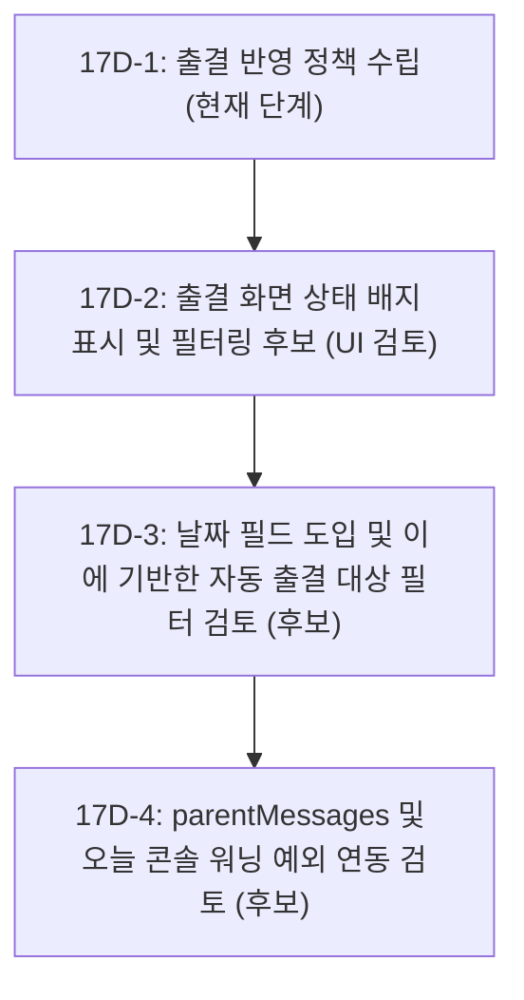

# Phase 17D-Policy: 휴원/퇴원 상태의 출결 반영 정책 설계서

본 문서는 튜링음악학원 DayDay 시스템에서 원생의 상태(`attending` / `on_leave` / `withdrawn`)가 출결 도메인(출결 체크, 원장 출결 화면, 학부모 출결 화면, 알림 메시지, 오늘 원장 콘솔)에 미치는 비즈니스 영향과 상태 전환에 따른 정책적 예외 처리 방안을 정리한 정책 검토 및 설계 문서입니다.

---

## 1. 현재 출결 구조 요약 (Current Attendance Architecture)

* **출결 데이터 구조**:
  - `db.attendance` 스키마는 각 원생의 일일 출결 상세 정보를 담고 있습니다.
  - 주요 필드: `id` (출결 식별자), `studentId` (원생 ID), `date` (출석 일자 `YYYY-MM-DD`), `status` (등원 상태: `present` / `late` / `absent`), `time` (등원 시간), `leavingTime` (하원 시간), `classTime` (수업 배정 시간), `note` (특이사항) 등으로 구성됩니다.
* **원장 출결 관리 화면 (`attendanceView.js`)**:
  - 선택한 날짜에 해당하는 강사-원생 일일 수업 시간표 데이터를 로드하여 목록을 렌더링합니다.
  - 원장은 이 화면에서 특정 원생의 등원(`markAttendance`), 하원(`leaveAttendance`), 결석 처리를 실행할 수 있습니다.
* **학부모 출결 현황 (`parent.js` / `student.js`)**:
  - 학부모 포털 로그인 시 자녀의 당월 출결 캘린더 달력 및 일자별 출결 이력 리스트를 조회할 수 있습니다.
  - 지각(늦은 등원 시 감지) 및 결석 현황이 실시간 배지로 렌더링됩니다.
* **출결 parentMessages (학부모 출결 알림 데이터)**:
  - 원장이 등원/하원/결석 처리를 진행할 때 `triggerAttendanceParentMessage`가 실행되어 학부모 수신용 출결 parentMessages가 백그라운드에서 생성 및 발송 대기 상태로 전환될 수 있습니다.
* **오늘 원장 콘솔 미출결/결석 관련 task**:
  - 수업 시간이 지났음에도 등하원 입력이 누락된 원생에 대해 오늘 할 일 콘솔에 "미등원 경고" 및 "하원 처리 누락" 등 업무 task가 생성될 수 있습니다.

---

## 2. 상태별 출결 정책 후보 (Status-Based Attendance Policy Candidates)

| 원생 상태 | 등하원/출결 체크 대상 | 과거 출결 이력 조회 | 오늘 할 일 (콘솔) 경고 대상 |
| :--- | :--- | :--- | :--- |
| **재원 (`attending`)** | **대상 포함 후보** (기존 유지) | **정상 조회 유지** | **대상 포함 후보** |
| **휴원 (`on_leave`)** | **체크 대상 제외 후보** (기간 적용) | **보존 및 조회 지원 후보** | **오늘 할 일 제외 후보** |
| **퇴원 (`withdrawn`)** | **체크 대상 제외 후보** (퇴원일 기준) | **보존 및 조회 지원 후보** | **오늘 할 일 제외 후보** |

> [!IMPORTANT]
> **과거 출결 이력 보존 원칙**
> - 원생의 상태가 휴원이나 퇴원으로 변경되더라도, **과거 재원 기간에 기록된 출결 로그는 훼손 없이 보존 및 조회 가능**해야 합니다. 교육청 감사나 학원 운영 증빙을 위해 원생 대장 상의 출결 기록 매칭은 필수 유지 원칙입니다.

---

## 3. 휴원 기간 정책 및 날짜 필드 부재의 위험성 (Leave Period & Missing Date Fields)

현재 Phase 17C 상태에서는 `student.status` 필드만 존재하며, 휴원의 구체적 시점을 정의하는 `leaveStartDate` (휴원 시작일) 및 `leaveEndDate` (휴원 종료일) 필드가 부재합니다. 이에 따른 정책 후보와 위험성을 비교합니다.

### 후보 대안 비교
* **대안 A: 단일 status 값 기준으로 즉시 출결 제외**
  - *방식*: `student.status === 'on_leave'` 상태이면 날짜 무관하게 오늘 자 출결 대상 및 경고 태스크에서 즉시 제외하는 정책 후보.
  - *장점*: 구현이 매우 직관적이고 간단합니다.
  - *단점*: 과거 이력 조회 화면에 치명적인 왜곡을 줍니다. 과거 재원 기간이었던 특정 날짜의 출결부를 조회할 때도 해당 학생이 "휴원생"으로 인지되어 대상에서 빠지거나 오표시됩니다. 또한 휴원에서 정상 복귀(`status: 'attending'`)하고 나면, 과거 휴원했었던 특정 기간의 날짜로 백커스 조회 시 출결 누락 경고가 다시 잘못 생성되는 소급 왜곡 버그가 발생합니다.
* **대안 B: 날짜 필드 도입 전까지 출결 제외 보류 (추천 후보)**
  - *방식*: `leaveStartDate`/`leaveEndDate` 스키마가 도입되기 전까지는, 출결 화면 내 원생 이름 옆에 `[휴원]` 상태 배지를 표시하는 수준으로 제한하고, 등하원 체크 및 미출결 경고 생성 로직에서의 필터링은 보류하는 대안.
  - *장점*: 데이터 오판 및 소급 계산 오류를 예방할 수 있으며, 시스템 안정성을 유지하기 용이합니다.

---

## 4. 퇴원일 정책 (Withdrawal Date Policy Candidates)

퇴원 상태의 경우에도 `withdrawalDate` (퇴원일) 필드가 아직 데이터 모델에 탑재되지 않은 상태입니다.

### 후보 대안 비교
* **대안 A: status 단일 값 기준으로 전체 일자 출석부에서 즉시 제외/은닉**
  - *방식*: `status === 'withdrawn'` 원생은 출결 대상에서 일괄 제외하며 출석부 노출에서 배제하는 방안.
  - *위험성*: 과거 해당 학생이 정상 등원했던 날짜의 출석부를 조회할 때도 학생 정보가 표시되지 않아 과거의 총 등원 일수 산출 및 과거 출결 통계 장부가 완전히 파괴됩니다.
* **대안 B: 퇴원일 필드 연계 및 기본 '재원생' 필터 제공 (추천 후보)**
  - *방식*: 출결 화면 진입 시 디폴트로 퇴원생을 숨기는 필터 설정을 제공하되, 과거 날짜 조회 시에는 퇴원생 필터 스위치 또는 검색을 통해 과거 이력이 렌더링되도록 격리하는 방안.
  - *장점*: 과거 시점의 등하원 증빙 데이터 무결성을 온전히 확보할 수 있습니다.

---

## 5. 원장 출결 화면 영향 (Director Attendance View UX Impact)

* **출석 체크 대상 목록 및 기본 필터**:
  - 기본 진입 시에는 **재원생 및 휴원생** 목록 위주로 노출하는 방안이 검토됩니다.
  - 퇴원생의 경우, 출결 화면 상단 필터 옵션을 선택적으로 제공하여 과거의 특정 시점 등하원 이력을 조회할 수 있게 하는 방안이 제안됩니다.
* **검색 결과**:
  - 검색 창을 통해 원생을 조회할 때 휴원/퇴원생도 결과에 포함하되, 이름 우측에 배지를 부착하여 비활성 원생임을 식별 가능하게 하는 방안.
* **완전 숨김의 위험성**:
  - 퇴원생을 출결 조회 화면에서 완전히 숨길 경우, 학부모의 과거 이력 확인 문의 대응이나 교육청 장부 대조 등의 상황에 대처할 수 없는 리스크가 있으므로 조회 권한 유지가 필요합니다.

---

## 6. 학부모 출결 화면 영향 (Parent Attendance View UX Impact)

* **자녀 출결 캘린더/리스트 유지 여부**:
  - 자녀의 상태가 `on_leave` 또는 `withdrawn`으로 변경되더라도 학부모는 **과거에 등원했던 시점의 출결 이력을 열람할 권한**이 제공되어야 합니다.
  - 따라서 학부모 포털의 출결 탭 접근 자체를 차단하기보다, **이력 조회 전용 모드(ReadOnly History Mode) 후보**로 제공하는 방안을 추천합니다.
* **상태 배지 및 안내문 후보**:
  - 학부모 화면 상단에 안내 배너 표시 후보를 제안합니다.
    - 예: *"현재 [휴원/퇴원] 상태입니다. 과거의 출결 이력 조회가 가능합니다."*
  - 상태값에 따라 캘린더 상단에 시각적인 상태 배지를 표기해 혼선을 예방합니다.

---

## 7. 출결 parentMessages 영향 후보

* **출결 parentMessages 알림 생성 제외 후보**:
  - 휴원 기간 또는 퇴원일 이후에는 출결 parentMessages 생성 대상에서 제외하는 가드 조건 후보가 검토됩니다.
* **정책 조율 사항**:
  - 이번 Phase 17D 정책 검토 단계에서는 기존 출결 parentMessages 생성 조건을 강제로 변경하지 않는 방향을 우선 검토합니다.
  - 휴원/퇴원 원생은 출석 체크 대상에서 제외 시 자연스럽게 알림 생성 이벤트가 발생하지 않기 때문입니다. 예외 조건 처리는 후속 구현 Phase에서 날짜 필드(`leaveStartDate`, `withdrawalDate`) 도입 시 결합하는 방향을 검토합니다.

---

## 8. 오늘 원장 콘솔 (todayTask) 영향 후보

* **미등원/결석 워닝 태스크 생성 후보**:
  - 오늘 스케줄이 배정되어 있는 원생 중 체크가 없는 경우 오늘 태스크 큐에서 휴원/퇴원생을 제외하는 후보가 검토됩니다.
  - 단, 날짜 정보(`leaveStartDate`, `withdrawalDate`)가 없는 단순 `status` 매핑만으로 제외 조건을 구현하면, 과거 날짜의 통계나 미결 태스크 보존 원칙이 깨져 과거 특정 시점의 업무 이력 로그가 오작동할 수 있으므로, 날짜 필드 없이 status만으로 제외 조건을 적용하지 않도록 강력한 주의가 요구됩니다.
  - 따라서 오늘 콘솔의 태스크 필터링은 날짜 기반 조건과 연계되는 후속 단계에서 반영하는 방안을 제안합니다.

---

## 9. 추천 단계별 구현 로드맵 후보 (Recommended Roadmap Candidates)

1. **17D-1: 출결 반영 정책 수립 (본 Phase)**
   - 비즈니스 영향 분석 및 소급 계산 왜곡 위험성을 공유하고 최종 정책 방향성 수립.
2. **17D-2: 출결 관리 화면 내 원생 상태 표시 및 필터링 검토 후보**
   - 원장 출결 리스트 및 검색 결과에 `[휴원]`, `[퇴원]` 배지를 렌더링하는 UI 후보.
   - 퇴원생을 기본 목록에서 숨기되 조회는 가능하도록 상태 필터 연계 후보.
3. **17D-3: 기간/날짜 데이터 필드 도입 및 자동 출결 스케줄 필터링 검토 후보**
   - `leaveStartDate`, `leaveEndDate`, `withdrawalDate` 필드를 스키마에 추가하는 안.
   - 지정된 휴원 예정 기간이나 퇴원 시점 이후 날짜에 대해 자동 출석 대상 매핑에서 배제하는 조건 후보.
4. **17D-4: parentMessages 및 오늘 콘솔 워닝 연동 검토 후보**
   - 등하원 메시지 오발송을 대비하는 가드 설정 후보.
   - 오늘 원장 콘솔(`todayTask`)의 미등원 경고 생성 시 휴원생/퇴원생 조건 연계 후보.

---

## 10. 위험 및 주의사항 요약 (Summary of Risks)

* **status 단일 필드 의존 오판**:
  - 날짜 필드 없이 status 값에만 의존해 출결 대상에서 원생을 배제하면, 복귀 시점이나 과거 이력 소급 분석 단계에서 데이터 왜곡(구체적인 출석 정보 유실)을 유발할 수 있어 날짜 필드 연계가 권장됩니다.
* **퇴원생 완전 은닉에 따른 CS**:
  - 퇴원생을 출결부에서 원천적으로 보이지 않게 설계할 경우, "지난 달 출결 확인서 발급 요청" 등 학부모의 사후 CS 인입 시 대처가 어려울 수 있으므로 필터 등으로 제공해야 합니다.
* **학부모 포털 CS 차단**:
  - 퇴원 자녀를 둔 학부모의 기존 등하원 증빙 열람 권한을 보장하지 않으면 증빙 분쟁이 발생할 위험이 있으므로, 조회 기능을 유지하는 방안이 권장됩니다.
